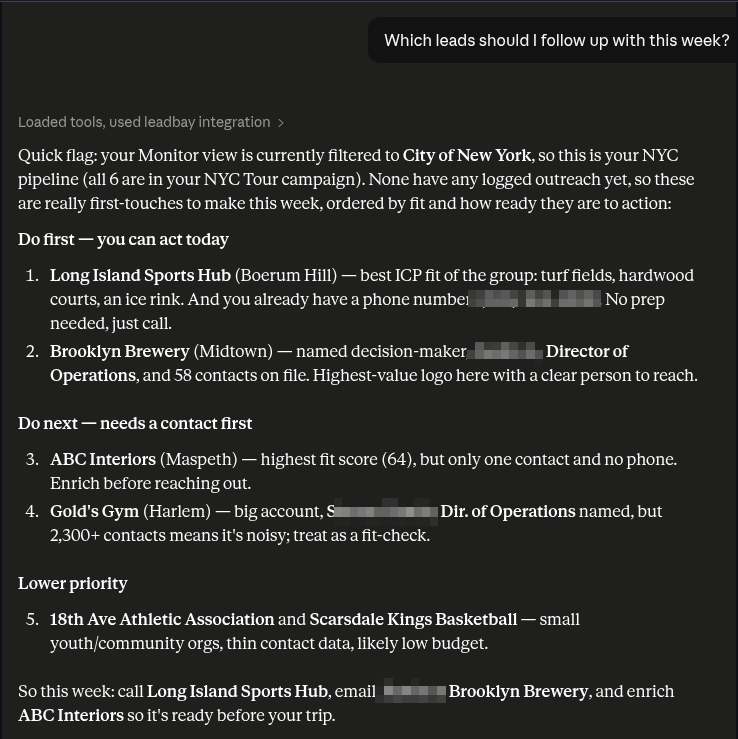
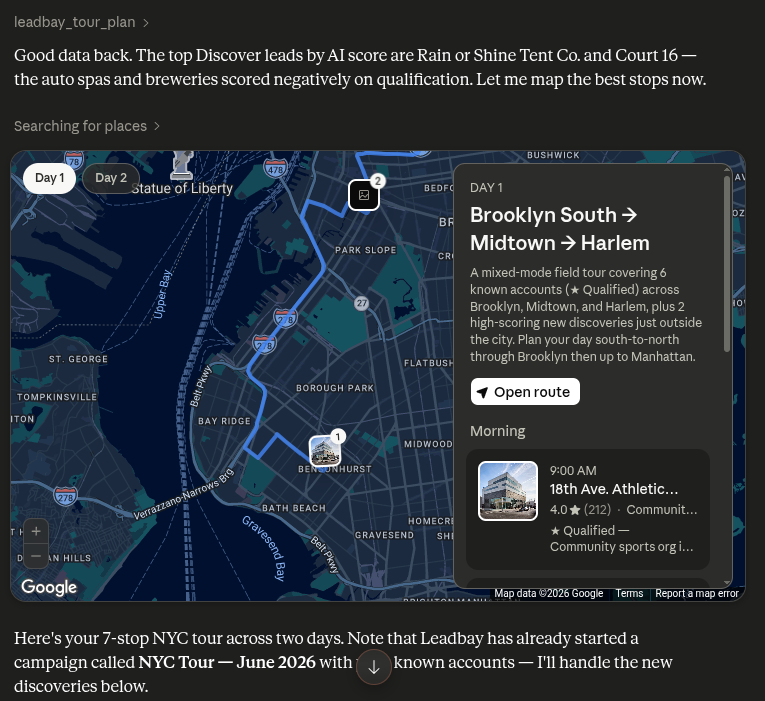
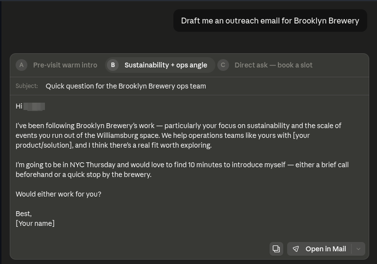
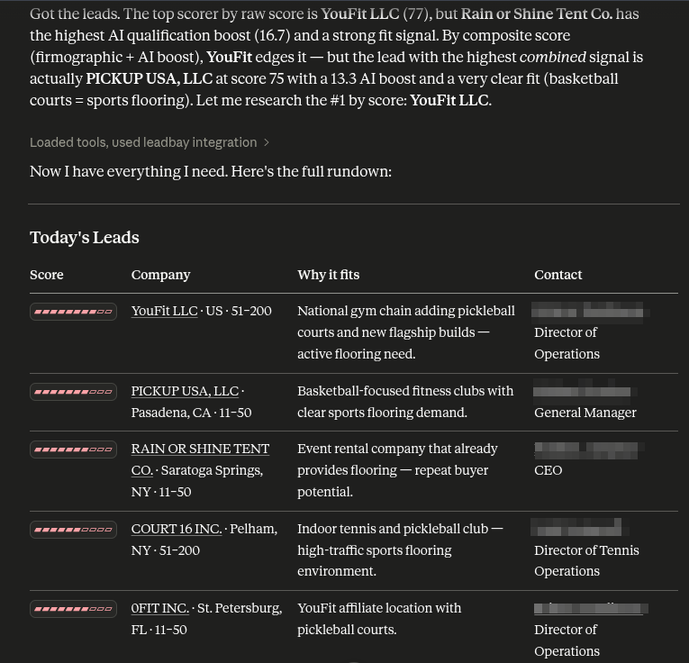
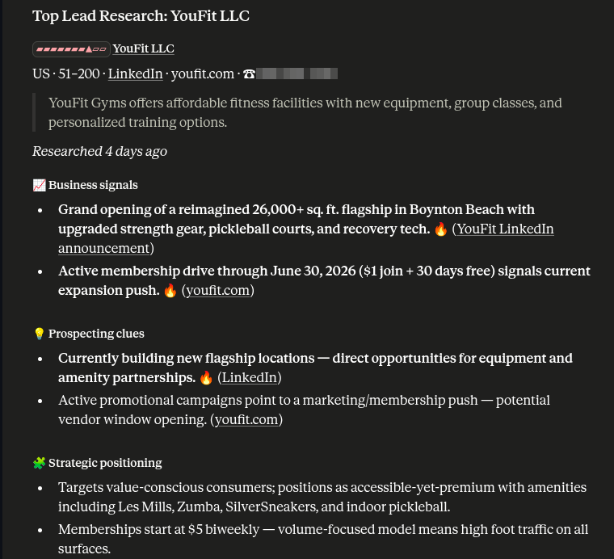
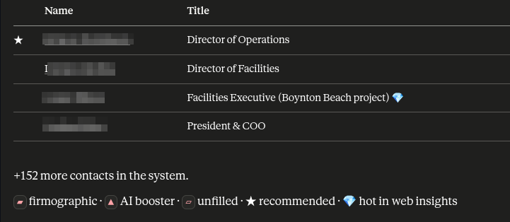
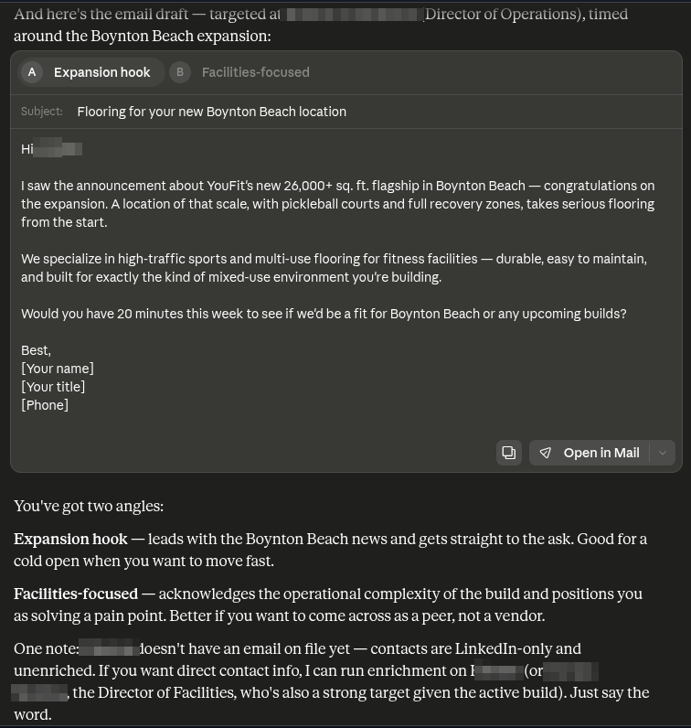

# Exemples de prompts

Leadbay MCP fonctionne mieux quand vous parlez à Claude comme à un collègue — décrivez le résultat, pas l'outil. Voici une bibliothèque de prompts qui fonctionnent d'emblée, regroupés par objectif. Copiez, adaptez, et appropriez-vous-les.


**Mieux dans le chat Claude.** Les résultats riches ci-dessous — tableaux de leads classés, cartes de tournée interactives et brouillons prêts à envoyer — s'affichent nativement là. Les autres clients MCP fonctionnent aussi, mais retombent en texte brut quand ils ne supportent pas ces vues.


---

## Commencer votre journée

> *Montre-moi les leads du jour.*

> *Qu'est-ce qu'il y a dans mon inbox ce matin ?*

> *Récupère mes meilleurs nouveaux prospects et dis-moi lesquels valent la peine d'être ouverts en premier.*

> *Donne-moi une vue d'ensemble de ma prospection — où en suis-je, que dois-je faire ensuite ?*

Claude récupère votre lot frais, le classe, et propose une courte liste. Il n'effectue aucune action tant que vous ne le demandez pas :

<figure><figcaption>
« Récupère mes meilleurs nouveaux prospects et dis-moi lesquels valent la peine d'être ouverts en premier. » Claude renvoie un tableau classé — fit, raison de qualification et meilleur contact — puis désigne les deux premiers avec une justification pour chacun.</figcaption></figure>

---

## Relancer & réengager

> *Quels leads dois-je relancer cette semaine ?*

<figure><figcaption>
« Quels leads dois-je relancer cette semaine ? » Claude lit votre vue Monitor et la classe en <strong>à faire d'abord</strong> (agir aujourd'hui), <strong>ensuite</strong> (enrichir un contact d'abord) et <strong>priorité basse</strong> — puis termine par les actions exactes : qui appeler, qui contacter par email, qui enrichir.</figcaption></figure>

> *Qui ai-je contacté et que je devrais relancer ?*

> *Quel est l'historique complet de ce compte — vaut-il une nouvelle visite ?*

> *Lesquels de mes leads ont acquis une entreprise depuis 2025 ?*

> *Scanne mon portefeuille pour des signaux de levée de fonds.*

Les prompts de scan de portefeuille filtrent vos leads existants par un signal web en une seule passe — pas besoin de rechercher chacun individuellement.

---

## Rechercher une entreprise

> *Parle-moi de jaxpartycompany.com — est-ce un bon fit pour nous ?*

> *Recherche Acme Corp et résume pourquoi ils ont ce score.*

> *Récupère les contacts et la qualification de ce lead.*

Claude renvoie une fiche de recherche avec le score de l'entreprise, pourquoi elle correspond, et le meilleur contact à joindre.

---

## Planifier un déplacement / terrain

> *Je vais à New York dans 2 jours — planifie une tournée de prospection.*

> *Je vais à Jacksonville dans 3 jours — planifie mes visites.*

> *Je m'envole pour Berlin jeudi — qui devrais-je rencontrer sur place ?*

> *Montre mes relances autour de Lyon sur une carte.*

> *Donne-moi 3 clients existants, 3 leads qualifiés et 3 nouveaux prospects près de Limoges, sur une seule carte.*

Ces prompts s'affichent sur une carte là où votre client le permet, avec le meilleur contact et une raison en une ligne par étape. Voici la tournée new-yorkaise ci-dessus, planifiée et cartographiée en une seule réponse :

<figure><figcaption>
« Je vais à New York dans 2 jours — planifie une tournée de prospection. » Claude choisit les comptes les mieux scorés, trace un itinéraire de deux jours de Brooklyn à Harlem sur une carte interactive, et regroupe le tout dans une campagne <strong>NYC Tour</strong> — comptes qualifiés plus nouvelles découvertes à fort score, chacun avec horaire et contact.</figcaption></figure>

---

## Rédiger & journaliser la prospection

> *Rédige-moi un email de prospection pour Brooklyn Brewery.*

> *Rédige-moi un email de prospection pour JAX PARTY COMPANY LLC.*

> *Écris une accroche d'appel à froid pour Acme — je vends un logiciel de gestion d'interventions.*

> *Je viens d'envoyer un email à Jane chez Acme. Journalise-le comme prospection.*

> *J'ai appelé Acme ce matin et laissé un message vocal — note-le.*

La rédaction est en lecture seule. La journalisation écrit l'activité sur votre compte. Un brouillon revient sous forme de plusieurs variantes prêtes à envoyer, chacune avec un angle différent :

<figure><figcaption>
« Rédige-moi un email de prospection pour Brooklyn Brewery. » Claude renvoie trois variantes de stratégie — une intro chaleureuse, un angle durabilité + opérations, et une demande directe — chacune personnalisée avec objet et corps, prête à ouvrir dans votre client mail.</figcaption></figure>

---

## Importer & qualifier une liste

> *J'ai 400 participants à un événement — importe-les et classe les plus prometteurs.*

> *Voici un CSV de domaines. Importe et qualifie le top 50.*

> *Qualifie les 10 meilleurs leads de mon lot.*

> *Où en est mon import ?*

Claude mappe les colonnes de votre fichier, importe les lignes, et peut lancer immédiatement la qualification IA sur les plus prometteuses.

---

## Gérer votre audience (lenses)

> *Montre-moi mes lenses et bascule sur celle de Joinery.*

> *Crée une lens appelée Joinery pour le secteur fintech.*

> *Arrête de me montrer les entreprises de plus de 50 employés.*

> *Je préfère les entreprises de l'UE qui recrutent activement des commerciaux — affine mon audience.*

> *Je veux plus de leads sur cette lens — un lot plus large aujourd'hui.*

Les changements de lens sont réversibles et reflétés immédiatement dans votre prochain pull.

---

## Construire une campagne d'équipe

> *Mets en place une campagne de prospection pour mon équipe.*

> *Crée une campagne pour les leads que je viens de qualifier et ajoute le top 20.*

> *Montre-moi comment progresse la campagne Q3.*

> *Donne-moi la feuille d'appels de la campagne de Lyon.*

Les campagnes persistent un cohorte de leads triés sur le volet que votre équipe peut travailler ensemble.

---

## Gérer les contacts

> *Acme n'a aucun contact — ajoute Jane Doe, VP Eng, voici son LinkedIn.*

> *Épingle Jane Doe comme contact principal sur cette entreprise.*

> *Mets à jour le poste de Jane Doe en SVP Engineering.*

> *Retire Jane Doe — je l'ai ajoutée par erreur.*

---

## Intendance & retours

> *Combien de quota d'enrichissement me reste-t-il ?*

> *Recharge mon quota.*

> *Envoie un feedback à l'équipe : les scores de leads me semblent décalés cette semaine.*

---

## Tout enchaîner

Vous pouvez demander toute une séquence en un seul message, ou la construire tour par tour :

> *Récupère les leads du jour, recherche le meilleur, et rédige-moi un email pour lui.*

> *Montre-moi mes relances près de Madrid, mets-les sur une carte, et prépare la prospection pour les trois plus proches.*

Claude conserve le contexte au fil de la conversation — une fois qu'il a fait remonter un lead, vous pouvez continuer à parler du « meilleur » ou de « cette entreprise » sans vous répéter. Voici ce premier prompt exécuté de bout en bout :

<figure><figcaption>
<strong>1. Récupérer les leads du jour.</strong> Un tableau classé avec barres de score, raison de qualification et meilleur contact — Claude choisit YouFit LLC, le mieux scoré, pour la recherche.</figcaption></figure>

<figure><figcaption>
<strong>2. Rechercher le meilleur.</strong> Une fiche détaillée sur YouFit : signaux business, indices de prospection et positionnement stratégique, chacun sourcé.</figcaption></figure>

<figure><figcaption>
<strong>…avec la bonne personne identifiée.</strong> Contacts classés par pertinence — le Director of Operations signalé comme contact recommandé.</figcaption></figure>

<figure><figcaption>
<strong>3. Rédiger l'email.</strong> Un brouillon personnalisé pour le contact recommandé, en deux angles (accroche expansion / angle opérations), lié à l'expansion de YouFit à Boynton Beach — prêt à ouvrir dans votre client mail.</figcaption></figure>

---

## Étape suivante

Nouveau ici ? Commencez par l'aperçu, puis connectez-vous.


[Qu'est-ce que Leadbay MCP ?](what-is-leadbay-mcp.md)



[Démarrage rapide](quickstart.md)

