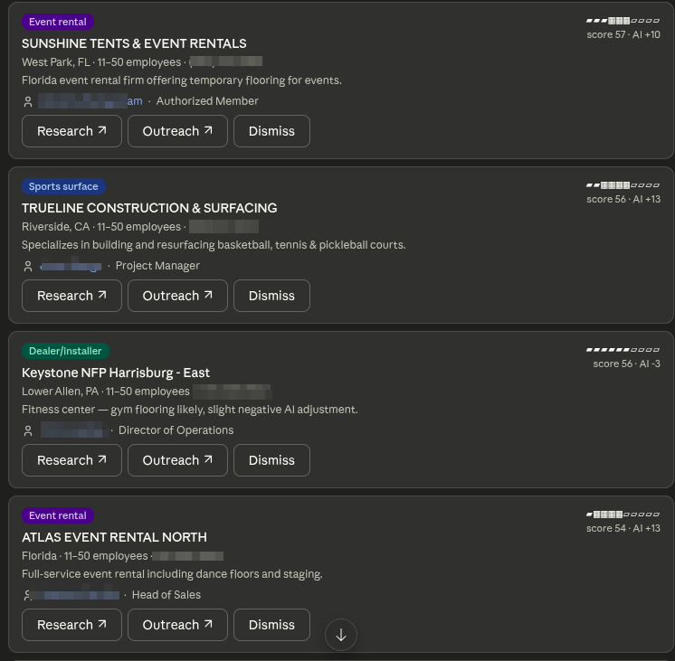
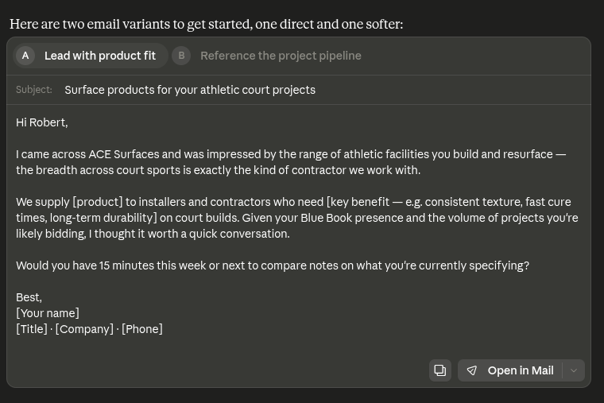

# Qu'est-ce que Leadbay MCP ?

**Leadbay MCP connecte Claude à votre compte Leadbay : vous travaillez vos leads en demandant, tout simplement.**

Récupérez des leads, qualifiez-les, rédigez votre prospection, journalisez vos actions — en langage naturel. Claude agit sur vos vraies données, avec vos permissions, exactement comme vous le feriez dans l'application.


**MCP** signifie *Model Context Protocol* — un standard ouvert qui permet aux assistants IA comme Claude de se connecter de façon sécurisée à des outils et des données externes. Le serveur Leadbay MCP est open source et se trouve sur [github.com/leadbay/mcp](https://github.com/leadbay/mcp).


---

## Pourquoi connecter Leadbay à Claude ?

Au lieu de basculer entre l'application Leadbay et votre flux de travail, vous travaillez en conversation :

> *Récupère les meilleurs leads du jour et dis-moi lesquels valent la peine d'être ouverts ce matin.*

> *Recherche acme.com — est-ce un bon fit pour nous ?*

> *Je viens d'envoyer un email à Jane chez Acme. Journalise-le comme action de prospection.*

Claude fait remonter les bonnes entreprises, raisonne dessus, et répond avec une analyse courte et qualifiée — puis effectue l'action que vous demandez.

---

## Où ça fonctionne

Leadbay MCP fonctionne avec tout assistant IA qui supporte le Model Context Protocol :

- **Claude Desktop**
- **Claude Cowork**
- **Claude Code**
- **Cursor**
- **Codex**

---

## En action

Demandez en langage naturel — Claude répond avec une liste classée de leads qualifiés :

<figure><figcaption>« Montre-moi les leads du jour » — une liste classée avec score de fit et le meilleur contact.</figcaption></figure>

…puis rédige la prospection pour vous :

<figure><figcaption>« Rédige un email d'intro » — des variantes prêtes à envoyer en quelques secondes.</figcaption></figure>

<!-- CAPTURE 3 (optionnelle) — une fiche de recherche / analyse détaillée d'entreprise. Ajoutez l'image dans .gitbook/assets/mcp-teaser-research.png et décommentez :
<figure><figcaption>« Recherche Acme » — un résumé de fit et le meilleur contact à joindre.</figcaption></figure>
-->

---

## Pour commencer

Connectez Leadbay à Claude et obtenez vos premiers leads en environ cinq minutes — sans coder, sans jeton à copier.


[Démarrage rapide](quickstart.md)

