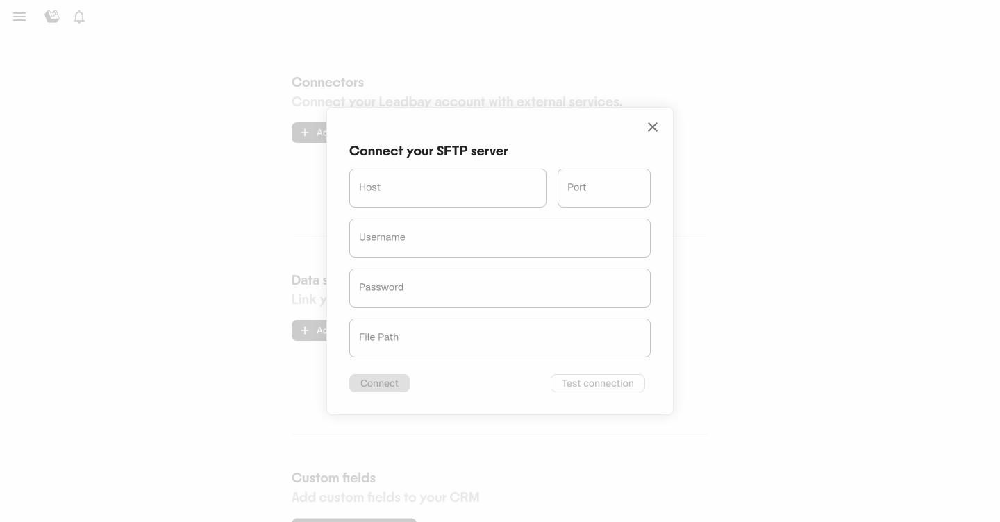
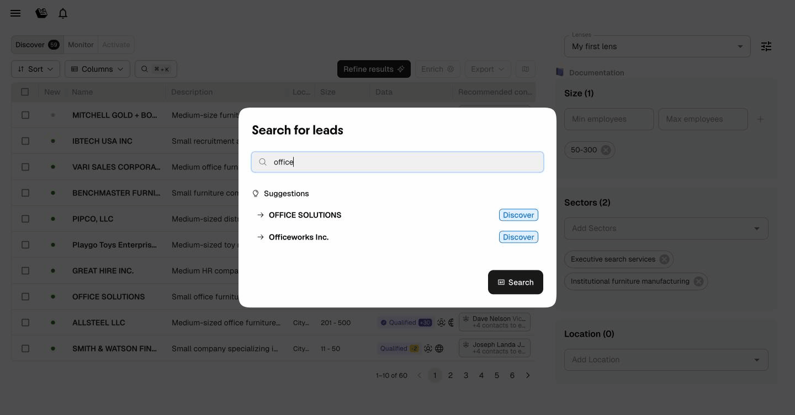
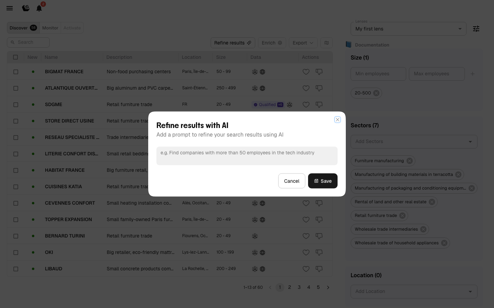
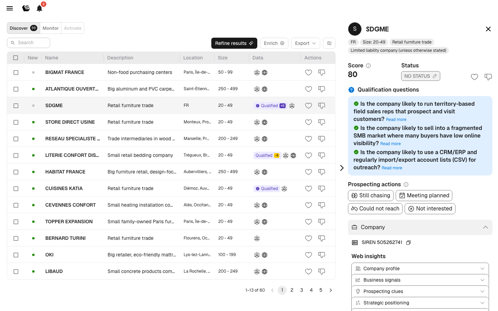

# Changelog

Leadbay publie des mises à jour chaque semaine. Voici les étapes majeures.

---

## Avril 2026

- **Connecteur SFTP** : connectez un serveur SFTP pour synchroniser automatiquement un fichier CSV avec vos leads. Leadbay détecte les modifications et ne ré-importe que si le fichier a changé. Réservé aux admins.

<figure><figcaption>
Le formulaire de connexion SFTP
</figcaption></figure>

- **Recherche globale** : appuyez sur ⌘K (Mac) ou Ctrl+K pour rechercher des leads dans Discover, Monitor et Activate. Des suggestions apparaissent au fil de la saisie.

<figure><figcaption>
Recherchez des leads par nom — des suggestions apparaissent au fil de la saisie
</figcaption></figure>
- **Suivi des enrichissements échoués** : les fiches contacts indiquent désormais quels canaux d'enrichissement ont échoué, avec possibilité de relancer et info-bulles de date d'échec. Les contacts déjà échoués peuvent être ignorés lors de l'enrichissement en masse.
- **Gestion des champs personnalisés** : les admins peuvent désormais ajouter et modifier des champs personnalisés directement depuis les paramètres Data Sources.

## Mars 2026

- **Requalify** : le bouton « Fetch web insights » s'appelle désormais **Requalify** — un clic pour récupérer des données actualisées depuis le site web d'un lead et relancer l'évaluation IA complète.

## Février 2026

- **Affiner les résultats avec l'IA** : décrivez en texte libre le type de leads que vous recherchez. L'IA utilise votre description comme consigne de recherche pour affiner ses recommandations — comme si vous expliquiez votre besoin à un collègue.

<figure><figcaption>
Décrivez votre lead idéal avec vos propres mots
</figcaption></figure>

- **Raisonnement IA visible** : l'IA affiche désormais son raisonnement de qualification directement dans les fiches leads — suivez étape par étape comment le modèle évalue chaque entreprise par rapport à vos critères.

<figure><figcaption>
Questions de qualification et raisonnement IA dans la fiche lead
</figcaption></figure>

- **Filiales sur la carte** : les filiales apparaissent désormais sur la vue carte aux côtés des sociétés mères, offrant une vision géographique complète des groupes d'entreprises.
- **Page de connexion redesignée** : une expérience de connexion entièrement repensée avec une mise en page plus claire et un nouveau branding.

<figure><figcaption>
La nouvelle page de connexion Leadbay
</figcaption></figure>

- **Export des contacts enrichis** : l'export CSV inclut désormais les contacts enrichis avec entreprise, nom, prénom, téléphone, email, poste et profil LinkedIn.
- **Enrichissement en masse** : sélectionnez plusieurs leads, choisissez les postes cibles et enrichissez les contacts par lot.
- **Sélectionner tout** : les opérations en masse supportent la sélection de tous les leads correspondant à vos filtres.

## Janvier 2026

- **Tarification à l'usage** : aucun lead consulté dans le mois = mois suivant facturé 0 €. Sans engagement.
- **Onboarding guidé en 8 étapes** : nouveau parcours intégré pour les nouveaux utilisateurs.
- **Classifications dans Activate** : les leads sont désormais triés en Activatable, On hold et Completed.
- **Changement de statut en masse** : modifiez le statut de plusieurs leads simultanément.
- **Intégration LinkedIn Ads** : exportez des leads vers les audiences LinkedIn Ads via Zapier.

## Octobre 2025

- **Fiche lead redesignée** : réponses de qualification avec indicateurs colorés (positif / neutre / négatif).
- **Label « Predicted Won »** : affiché sur les leads très proches de votre profil d'affaires gagnées.
- **Prochaines étapes générées par l'IA** : le modèle suggère des angles d'approche recommandés.

## Septembre 2025

- **Inscription en libre-service** : essayez Leadbay gratuitement depuis le site — ni démo, ni intégration complexe.
- **AI Chat dans les fiches leads** : préparez vos rendez-vous et générez des résumés avec l'IA.
- **AI Assistant avec questions de qualification** : configurez jusqu'à 5 questions stratégiques.
- **Détection automatique des champs** : Leadbay détecte automatiquement les champs lors de l'import de fichiers.

## Juillet 2025

- **Onglet Activate** : espace dédié à la prospection quotidienne.
- **Fiche lead redesignée** : onglets Entreprise, Contacts, Notes, Historique, Filiales.
- **Résumé IA** : aperçu automatique visible dans la fiche lead.
- **Actions de prospection** : enregistrez en un clic — Still chasing, Meeting planned, Could not reach, Not interested.
- **Web Fetch** : récupérez des données fraîches depuis le site web d'un lead.
- **« Liked leads » remplace « Saved leads »** : mise à jour terminologique.
- **Notifications** : alertes quand les enrichissements de contacts sont terminés.

## Avril 2025

- **Enrichissement de contacts** : enrichissez avec emails et téléphones via le partenariat FullEnrich (~80% emails, ~65% téléphones).

## Mars 2025

- **Application mobile** : Leadbay disponible en PWA pour iPhone et Android.

## Février 2025

- **Dashboard Manager** : les managers peuvent suivre la performance de prospection de leur équipe.
- **Langue française** : l'application détecte automatiquement la langue du navigateur.

## Décembre 2024

- **Descriptions dans la liste** : descriptions d'entreprises visibles directement dans le tableau.
- **Filtre canton/ville** : distinction entre régions administratives et villes dans les filtres de localisation.
- **Timeline** : recommandations intelligentes basées sur les interactions utilisateur.

## Octobre 2024

- **Like/dislike rapide** : boutons directement dans les lignes du tableau.

## Septembre 2024

- **Vue carte** : visualisez les leads sur une carte géographique, partagez le lien.

## Juillet 2024

- **Timeline** : recommandations IA qui apprennent de toutes vos actions sur Leadbay.

## Mai 2024

- **Discover en continu** : flux continu de nouveaux leads. Les leads inactifs sont automatiquement remplacés.

## Avril 2024

- **Lenses** : configurations de filtres sauvegardées pour différents segments de marché.

## Février 2024

- **Connecteur Zapier** : import et export de leads entre Leadbay et votre CRM via Zapier.
- **Refonte du scoring** : échelle 0–99 basée sur la similarité IA avec vos affaires gagnées.

## Janvier 2024

- **Descriptions IA** : chaque lead reçoit un résumé auto-généré de ses produits, services et marché.
- **Modes Discover et Monitor** : deux vues — recommandations IA (Discover) et suivi pipeline (Monitor).
- **Prédictions de statut** : résultats prédits affichés pour les leads en cours.
