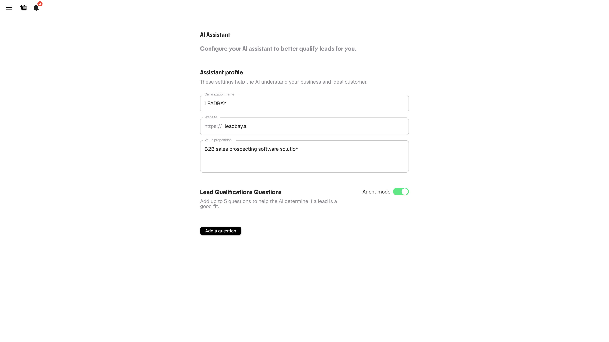

# AI Assistant

L'AI Assistant qualifie automatiquement les leads en répondant à des questions personnalisées sur chaque entreprise. Il vous aide à vous concentrer sur les leads qui correspondent vraiment à votre ICP, sans recherche manuelle.

---

## Fonctionnement

1. Vous définissez votre profil d'organisation et vos questions de qualification
2. L'IA analyse chaque lead à partir de données publiques, de web insights et de votre description ICP
3. Les réponses apparaissent directement dans les fiches leads sous forme d'indicateurs colorés (🟢🔘🔴)
4. Les réponses influencent le score, faisant remonter les leads les mieux qualifiés

---

## Configuration

Ouvrez **AI Assistant** depuis le menu latéral (icône hamburger, en haut à gauche).

<figure><figcaption>
Configuration de l'AI Assistant
</figcaption></figure>

### Profil de l'assistant

Renseignez ces champs pour calibrer l'IA :

| Champ | Que renseigner |
|-------|----------------|
| **Nom de l'organisation** | Le nom de votre entreprise |
| **Site web** | L'URL de votre site |
| **Proposition de valeur** | Ce que vous vendez et à qui — soyez précis |

Plus votre proposition de valeur est claire, mieux l'IA comprend ce qui rend un lead pertinent.

### Questions de qualification

Ajoutez jusqu'à **5 questions** importantes pour votre processus de qualification.

**Exemples :**

- « Cette entreprise utilise-t-elle un CRM ? »
- « Recrute-t-elle des commerciaux ? »
- « Opère-t-elle dans le secteur du BTP ? »
- « Son chiffre d'affaires est-il en croissance ? »
- « A-t-elle une présence internationale ? »

L'IA tentera de répondre à chaque question pour chaque lead de votre pipeline. Les réponses s'affichent comme :

- 🟢 **Oui / Signal positif**
- 🔘 **Inconnu / Incertain**
- 🔴 **Non / Signal négatif**

### Mode Agent

Activez le **mode Agent** pour que l'IA suggère proactivement des prochaines étapes et des angles d'approche pour chaque lead. Lorsqu'il est activé, les fiches leads incluent des recommandations générées par l'IA sur la meilleure manière d'engager la conversation.

### Affiner les résultats

En plus des questions de qualification, vous pouvez décrire votre lead idéal en texte libre grâce au bouton **Refine results**. Cela fonctionne comme une consigne de recherche : expliquez à l'IA le type d'entreprises que vous recherchez, et elle ajustera ses recommandations en conséquence.

La consigne textuelle complète vos filtres et questions : les filtres définissent des limites strictes, les questions qualifient chaque lead individuellement, et la consigne textuelle oriente la direction globale des recommandations.

<figure><figcaption>
Saisissez une description textuelle pour guider les recommandations IA
</figcaption></figure>

---

## Impact sur le scoring

Les réponses de qualification influencent le score. Les leads répondant positivement à davantage de questions sont mieux classés. Combiné aux signaux de like/dislike et à l'historique des affaires gagnées, cela crée un système de scoring multicouche.


Commencez avec 2-3 questions et affinez au fil du temps. Trop de questions vagues diluent le signal.

