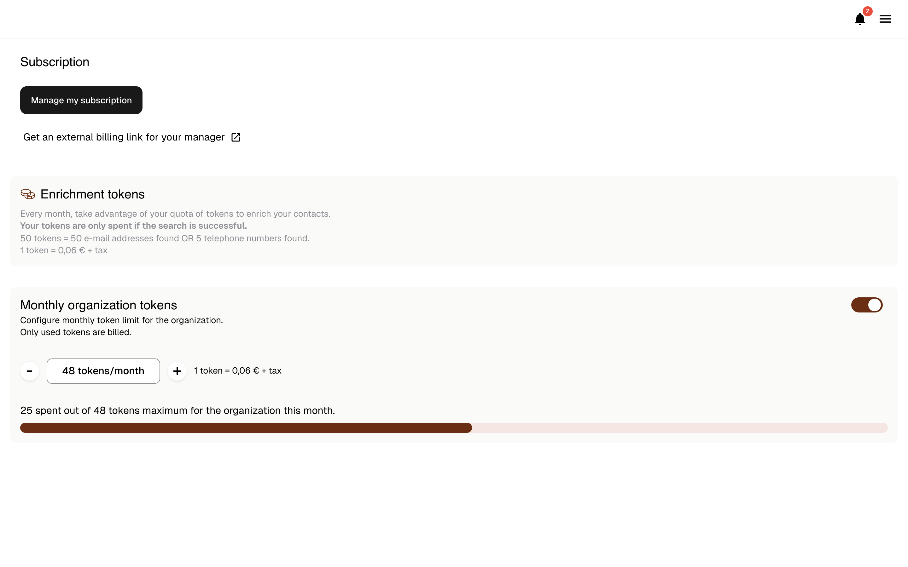

# Enrichissement de contacts

### 1. D'où viennent les numéros de téléphone et les emails ?

Leadbay s'appuie sur **FullEnrich**, le fournisseur le plus fiable que nous ayons testé.\
FullEnrich utilise une **stratégie en cascade** — interrogeant plus de 15 bases de données successivement. Si une source n'a pas la donnée, la suivante est interrogée automatiquement.

**Résultats :**

* Téléphones : ~65% de couverture
* Emails : ~80% de couverture

Testé sur différents secteurs et types d'entreprises.

### 2. Enrichir un contact suggéré

1. Ouvrez la fiche d'un lead, onglet **Contacts**

<figure><figcaption></figcaption></figure>

2. Cliquez sur **Enrich** sur un contact suggéré

<figure><figcaption></figcaption></figure>

3. Attendez quelques secondes (2 minutes max)
4. Vous n'êtes facturé que si les données sont trouvées

**Comment Leadbay suggère-t-il des contacts ?**

Leadbay suggère automatiquement des personnes à enrichir en fonction de votre **persona cible**.

Si votre cible est **Directeur Commercial**, Leadbay trouvera et suggérera :

* Des personnes **proches de ce rôle** (ex. Responsable des Ventes, Directeur du Développement)
* Au sein des entreprises que vous suivez

Les suggestions apparaissent sous **« To be enriched contacts »**.\
Une fois enrichis, ils passent dans **« Enriched / added contacts »** avec email, téléphone et profil LinkedIn.

<figure><figcaption></figcaption></figure>

### 3. Enrichir un contact non suggéré

<figure><figcaption></figcaption></figure>

Deux options :

1. **Saisie manuelle** : entrez nom et prénom via **Add contact**, puis cliquez sur **Enrich**
2. **LinkedIn** : collez l'URL LinkedIn dans **Add contact**, puis cliquez sur **Enrich**

### 4. Enrichissement en masse

Vous pouvez enrichir les contacts de plusieurs leads à la fois :

1. Sélectionnez des leads via les cases à cocher dans n'importe quel onglet (Discover, Monitor ou Activate)
2. Cliquez sur **Enrichment** dans la barre d'outils
3. Choisissez les **intitulés de poste** que vous souhaitez cibler
4. Lancez l'enrichissement en masse

Vous recevrez une **notification** (icône cloche, en haut à droite) une fois les enrichissements terminés.

### 5. Combien ça coûte ?

* **Email** : 1 token (0,06 € par résultat)
* **Téléphone** : 10 tokens (0,60 € par résultat)

**Exemples :**

* 30 € → jusqu'à 500 emails **ou** 50 téléphones
* 3 000 € → jusqu'à 50 000 emails **ou** 5 000 téléphones

### 6. Abonnement et tokens d'enrichissement

Gérez la facturation et les tokens d'enrichissement depuis l'onglet **Subscription** dans le menu latéral.

<figure><figcaption>
Abonnement et tokens d'enrichissement
</figcaption></figure>

#### Facturation

* Leadbay utilise **Stripe** pour la facturation sécurisée
* Cliquez sur **« Manage my subscription »** pour mettre à jour votre moyen de paiement ou votre abonnement

#### Tokens d'enrichissement

* Vous disposez d'un pack mensuel de tokens (variable selon votre plan)
* La barre de progression indique combien de tokens vous avez utilisés
* Vous n'êtes **facturé que pour les tokens consommés avec succès**
* Ajustez votre pack mensuel avec les boutons **+ / –**
* Activez/désactivez l'enrichissement à tout moment via le switch

### 7. Confidentialité

Vos données enrichies sont **visibles uniquement par votre organisation**.\
Elles ne seront **jamais** partagées avec ou réutilisées par d'autres clients Leadbay.
