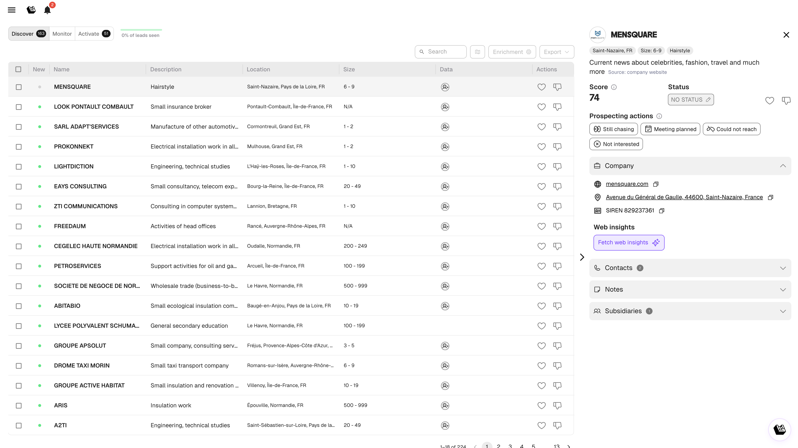

# Discover, Monitor & Activate

Leadbay organise votre prospection en trois onglets. Chacun remplit un rôle distinct dans le cycle de vie des leads.

## Le flux des leads

```
Discover → Like → Activate → Prospecter → Monitor
```

1. **Discover** fait remonter de nouveaux leads recommandés par l'IA
2. Vous **likez** ceux qui correspondent à votre cible
3. Les leads likés apparaissent dans **Activate** pour la prospection quotidienne
4. Au fil de vos actions (enrichissement, messages, rendez-vous), les leads changent de statut
5. Les leads exportés ou avec un statut attribué se retrouvent dans **Monitor** pour le suivi à long terme

---

## Discover

Des leads recommandés par l'IA en fonction de votre ICP (Ideal Customer Profile), de vos affaires gagnées et de votre historique de likes/dislikes.

<figure><figcaption><p>Onglet Discover</p></figcaption></figure>

**Ce que vous voyez :**

| Colonne | Signification |
|---------|---------------|
| Point vert | Nouveau lead, pas encore consulté |
| Nom | Nom de l'entreprise |
| Description | Court résumé généré par l'IA |
| Localisation | Ville / région |
| Taille | Tranche d'effectifs |
| Data | Indicateur de complétude des données |

**Actions principales :**

- **Like** (pouce vers le haut) : indique au modèle « montre-moi des leads similaires ». Le lead passe dans Activate.
- **Dislike** (pouce vers le bas) : indique au modèle « pas pertinent ». Le lead est retiré de Discover.
- **Cliquer sur un lead** pour ouvrir sa fiche et consulter les détails avant de décider.

<figure><figcaption><p>Panneau de détail d'un lead (vue scindée)</p></figcaption></figure>

**Comment la liste se renouvelle :** Leadbay alimente en continu Discover avec de nouveaux leads. Les leads ignorés sont automatiquement remplacés pour faire place à de nouveaux. Les leads exportés passent dans Monitor.


Likez 10 à 20 leads par session pour de meilleurs résultats. Liker en masse dilue le signal envoyé à l'IA.


---

## Monitor

Votre pipeline : leads importés depuis un fichier, exportés depuis Discover ou synchronisés via Zapier. Utilisez Monitor pour scorer et suivre vos comptes existants.

<figure><figcaption><p>Onglet Monitor</p></figcaption></figure>

**Colonnes :** Nom, Description, Statut, Localisation, Taille, Complétude des données.

**Statuts des leads :**

| Statut | Signification |
|--------|---------------|
| WANTED | Vous souhaitez poursuivre ce lead |
| NO STATUS | Pas encore classé |
| WON | Affaire conclue |
| LOST | Affaire perdue |

**Actions principales :**

- Cliquer sur un lead pour ouvrir sa fiche et modifier son statut
- Utiliser les filtres (via les Lenses) pour se concentrer sur des segments précis
- Exporter des leads en CSV


Les leads exportés depuis Discover apparaissent ici automatiquement. C'est pourquoi ils « disparaissent » de Discover : ils ont intégré votre pipeline.


---

## Activate

Votre espace de prospection quotidien. Affiche les leads likés prêts à être contactés, classés par pertinence.

<figure><figcaption><p>Onglet Activate</p></figcaption></figure>

**Colonnes :** Actions du jour, Nom, Description, Localisation, Source, Prochaine étape, Statut, Dernière action.

**Classifications des leads :**

- **Activatable** : leads prêts pour la prise de contact
- **On hold** : leads en pause
- **Completed** : leads avec un statut final

**Actions par lead** (via le menu déroulant Actions) :

- **Still chasing** : vous êtes en cours de relance
- **Meeting planned** : un rendez-vous est planifié
- **Could not reach** : pas de réponse
- **Not interested** : le lead a décliné

**Comment utiliser Activate au quotidien :**

1. Ouvrez Activate en début de session de prospection
2. Parcourez les leads de haut en bas
3. Ouvrez chaque fiche, consultez le résumé IA et les réponses de qualification
4. Enrichissez les contacts, préparez votre approche
5. Enregistrez votre action de prospection


Visez un ratio 1:1 entre leads likés et actions de prospection. Liker sans agir, c'est le « mode écureuil » : ça ne conclut pas d'affaires.

