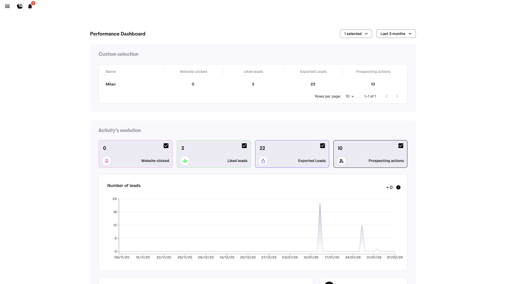

# Tableau de bord Manager

Le Dashboard offre aux managers une visibilité sur l'activité de prospection de leur équipe, et permet aux commerciaux de suivre leur propre performance.

<figure><figcaption>
Tableau de bord Manager
</figcaption></figure>

---

## Accès

Ouvrez le menu latéral (icône hamburger, en haut à gauche) et cliquez sur **Dashboard**.

---

## Filtres

- **Sélecteur de membres** : un, plusieurs ou tous les membres de l'équipe
- **Période** : 3 derniers mois, dernier mois, dernière semaine, ou personnalisée

---

## Tableau de métriques

| Métrique | Ce qu'elle mesure |
|----------|-------------------|
| **Website clicked** | Nombre de sites web de leads visités |
| **Liked leads** | Leads likés |
| **Exported leads** | Leads exportés en CSV ou vers le CRM |
| **Prospecting actions** | Actions enregistrées (still chasing, meeting planned, etc.) |

Chaque ligne correspond à un membre de l'équipe. Utilisez ce tableau pour repérer qui est actif et qui pourrait avoir besoin de soutien.

---

## Graphique d'évolution

Le graphique montre les tendances dans le temps. Activez/désactivez les métriques avec les cases à cocher.

Ce graphique capture **chaque interaction** — les chiffres peuvent être plus élevés que la liste de leads (un utilisateur peut interagir plusieurs fois avec le même lead).


Ouvrez le Dashboard à chaque réunion d'équipe hebdomadaire. 10 secondes suffisent pour repérer qui construit son élan et qui décroche.

