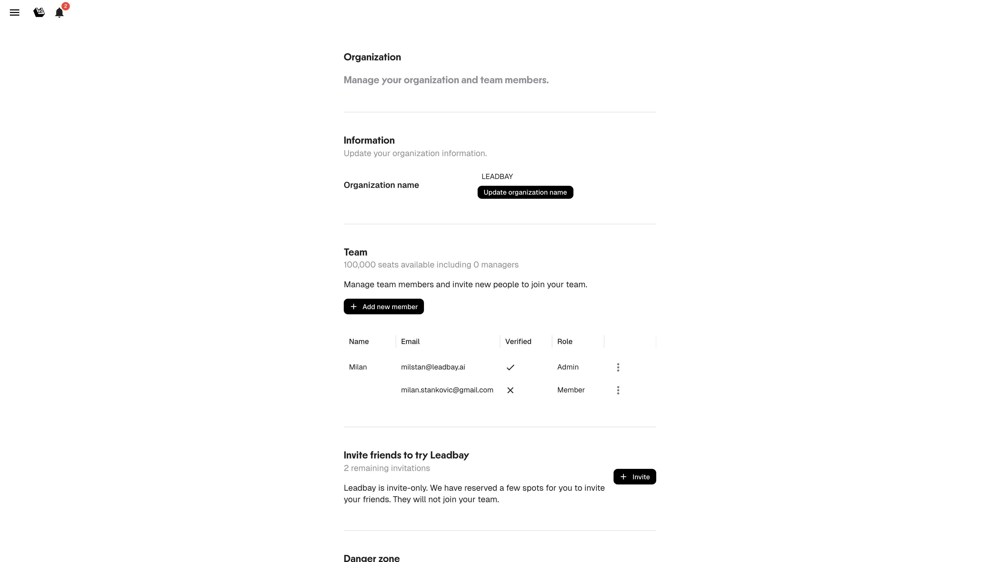

# Équipe & Organisation

Gérez les paramètres de votre organisation et les membres de votre équipe depuis le menu latéral.

---

## Informations de l'organisation

Ouvrez le menu latéral (icône hamburger, en haut à gauche) et allez dans **My Organization**.

<figure><figcaption>
Paramètres de l'organisation
</figcaption></figure>

Ici, vous pouvez :

- Consulter et modifier le **nom de votre organisation**

---

## Membres de l'équipe

La section Membres affiche tous les membres et un compteur de sièges (ex. *« 100,000 seats available including 0 managers »*). Chaque ligne contient :

| Colonne | Description |
|---------|-------------|
| **Name** | Nom affiché |
| **Email** | Email de connexion |
| **Verified** | Si l'utilisateur a confirmé son email |
| **Role** | Admin ou Member |
| **Manager** | Le manager de l'utilisateur (défini lors de l'invitation ou de la modification d'un membre) |

### Ajouter des membres

Cliquez sur **+ Add new member** pour inviter quelqu'un par email. Le dialogue demande :

1. Un **Email**
2. Un **Role** — `Admin` ou `Member` (avec une description d'une ligne de ce que chacun peut faire)
3. Si vous choisissez `Member`, un menu déroulant **Manager (optional)** pour lui assigner son manager depuis les membres existants

L'invité reçoit une invitation par email à rejoindre votre organisation.

### Rôles

| Rôle | Capacités |
|------|-----------|
| **Admin** | Accès complet : gestion équipe, paramètres, sources de données, facturation, lenses |
| **Member** | Utilisation de Leadbay : discover, like, enrichir, exporter, activate. Pas d'accès aux paramètres ni à la facturation |
| **Manager** | Un Member qui est le manager d'un ou plusieurs autres membres. Obtient la visibilité sur l'activité de ses subordonnés dans le [Dashboard Manager](manager-dashboard.md). Ne modifie pas les permissions applicatives — change seulement qui apparaît sous qui |

Utilisez le menu d'actions (trois points) sur chaque ligne pour modifier le rôle d'un membre, définir/modifier son manager, ou le retirer.


Seuls les admins peuvent importer des données, gérer la facturation et modifier les paramètres de l'organisation.

