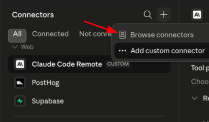
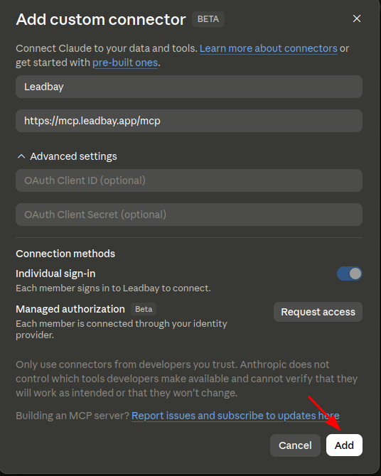

# Admin setup

**For workspace and organization admins.** This page walks you through adding the
Leadbay connector once, for your whole organization, so every member can connect
without needing admin rights themselves.

If you landed here because a teammate asked you to "add the Leadbay connector" —
you're in the right place. It takes a couple of minutes, there are no API tokens
to hand out, and each member still signs in with **their own** Leadbay account.


**Are you sure you need this?** Only **organization** plans gate custom connectors
behind an admin:

- **Claude** — Team and Enterprise workspaces.
- **ChatGPT** — Business and Enterprise workspaces.

On an individual paid plan (Claude Pro/Max, ChatGPT Plus/Pro), there's no admin
step — you can add the connector yourself. Just follow the
[Quickstart](quickstart.md) or [Installation](installation.md) guide.


---

## Claude (Team & Enterprise)

As a **primary owner or admin**, you add Leadbay as an **organization** custom
connector. Once it's added, it appears in every member's connector directory and
they connect to it individually.

**1. Open the Add custom connector form.** Use this link (or in Claude, go to
**Settings → Connectors**, then the **+** next to the search bar → **Add custom
connector**):


[https://claude.ai/customize/connectors?modal=add-custom-connector](https://claude.ai/customize/connectors?modal=add-custom-connector)


<figure><figcaption><p>The + menu → Add custom connector</p></figcaption></figure>

**2. Add it for the organization.** Fill in the fields, and if Claude offers a
choice of scope (organization vs. just you), choose the **organization** scope so
every member gets it:

- **Name:** `Leadbay`
- **URL:** `https://mcp.leadbay.app/mcp`

Leave the Advanced settings as they are — **Individual sign-in** is what you want.
Each member authenticates with their own Leadbay login; you are **not** sharing
one account across the team.

<figure><figcaption><p>Name it Leadbay, paste the URL, click Add</p></figcaption></figure>

**3. Click Add.** That's the admin part done — Leadbay now shows up in your
members' connector directory.


**Members can't add it themselves.** In a Team or Enterprise workspace, members
don't have the **Add custom connector** option — that's exactly why this admin
step exists. Once you've added it, they just search "Leadbay", open it, click
**Connect**, and sign in.


**What your members do next:** point them at the [Quickstart](quickstart.md). They
open the **Leadbay** connector, click **Connect**, and sign in with their own
Leadbay account — no further admin involvement needed.

---

## ChatGPT (Business & Enterprise)

On Business and Enterprise workspaces, custom MCP connectors are off until a
**workspace owner or admin** allows them. You don't add Leadbay for everyone here
— you unlock the ability, and each member then adds it themselves.

1. Open your **workspace settings** (workspace menu, bottom-left → **Settings**).
2. Under the connector / apps controls, **allow custom connectors** for the
   workspace (this is the workspace-level switch that gates Developer-mode custom
   apps for members).
3. Let your members know they can now add Leadbay.

**What your members do next:** each member follows the **ChatGPT** section of the
[Installation](installation.md) guide — turn on Developer mode, **Create app**
with **Name** `Leadbay MCP`, **Server URL** `https://mcp.leadbay.app/mcp`, and
**OAuth**, then sign in with their own Leadbay account.


The exact wording and location of the "allow custom connectors" control changes
as ChatGPT's admin console evolves. If you can't find it, search the workspace
settings for **connectors** or **apps**, or check OpenAI's current admin
documentation.


---

## Claude Code & Codex — no admin step

The command-line clients (**Claude Code**, **Codex**) connect per user — there's
no organization gate to open. Each member just runs the one-line add command from
the [Installation](installation.md) guide on their own machine:

```bash
# Claude Code
claude mcp add --scope user --transport http leadbay https://mcp.leadbay.app/mcp

# Codex
codex mcp add leadbay --url https://mcp.leadbay.app/mcp
```

Nothing for you to do as an admin — you can simply forward them the Installation
guide.

---

## Fallback: install the `.dxt` extension (no admin needed)

Can't get the connector URL to work — the **Add custom connector** option is
missing, your admin can't add it, or the URL route just won't cooperate? On
**Claude Desktop** there's a second path that doesn't touch the organization
connector at all: install Leadbay as a **`.dxt` extension**. It's a per-user
double-click install, so any member can do it themselves.

1. **[⬇ Download the Leadbay extension (.dxt)](https://github.com/leadbay/mcp/releases/latest/download/leadbay-latest.dxt)** — this pulls the latest version directly.
2. **Double-click the downloaded `.dxt`.** Claude opens with the extension
   details — click **Install**, then toggle the extension to **Enabled**.
3. Open a new chat, click **Connect** on the extension, and sign in with your
   Leadbay account (same one-tap **Sign in with Leadbay** flow — no tokens).


Claude didn't open on double-click? Install it from inside the app:
**Settings → Extensions → Advanced → Install extension**, then pick the `.dxt`
file you downloaded.



The `.dxt` route is **Claude Desktop only**. For Claude.ai (web) and ChatGPT,
the custom connector is the only path — if it's missing, that's an admin gate,
so use the sections above. Claude Code and Codex use their one-line commands.


When a new release ships, repeat step 1 (download the new `.dxt`, double-click,
Install). Claude replaces the old version in place and your sign-in carries over.

---

## Where to next


[Installation](installation.md)



[Quickstart](quickstart.md)

