# Installation

Step-by-step setup for every assistant that works with Leadbay. Pick your client below — each takes a couple of minutes, and **none of them need an API token**. You add one server URL, sign in once with your Leadbay account, and you're connected.


**Before you start, you need:**

- A [Leadbay account](https://leadbay.ai/) (the same login you use for the web app).
- One of the assistants below: **Claude.ai**, **Claude Desktop**, **Claude Code**, **ChatGPT**, or **Codex**.

Everywhere a server URL is asked for, it's:

```
https://mcp.leadbay.app/mcp
```

Sign-in is handled by your browser (OAuth) — there are no tokens to copy or paste.


---

## Claude.ai (web)

Add Leadbay as a **custom connector**.

**1. Open the Add custom connector form.** Click this link (or in Claude, go to **Settings → Connectors**, then the **+** next to the search bar → **Add custom connector**):


[https://claude.ai/customize/connectors?modal=add-custom-connector](https://claude.ai/customize/connectors?modal=add-custom-connector)


<figure><figcaption><p>The + menu → Add custom connector</p></figcaption></figure>

**2. Fill in the fields and click Add:**

- **Name:** `Leadbay`
- **URL:** `https://mcp.leadbay.app/mcp`

Leave the Advanced settings as they are (Individual sign-in is fine).

<figure><figcaption><p>Name it Leadbay, paste the URL, click Add</p></figcaption></figure>

**3. Find the Leadbay connector** in the directory (search "Leadbay" — it appears under **Custom connectors**) and open it.

<figure>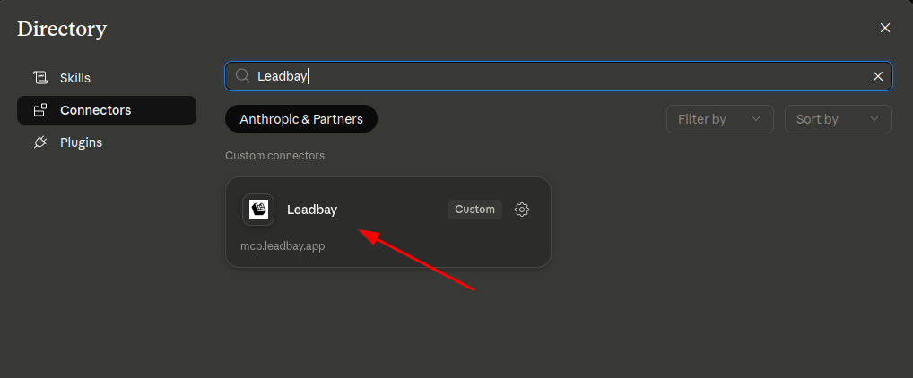<figcaption><p>Your new Leadbay custom connector</p></figcaption></figure>

**4. Click Connect** and sign in. A **Sign in with Leadbay** page opens — log in and approve. The connector shows as connected, and the Leadbay tools are available in your chats.

<figure>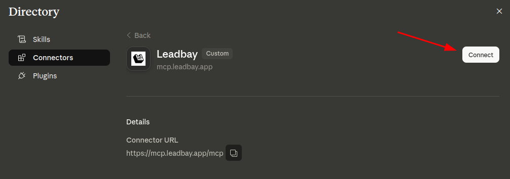<figcaption><p>Click Connect, then sign in with Leadbay</p></figcaption></figure>


**Not an admin of your organization?** Members can't add a custom connector themselves — your **workspace admin** needs to add the Leadbay connector first (steps 1–2 above). Send them the [Admin setup](admin-setup.md) guide. Once the admin has added it, you'll find it in the directory and can **Connect** (steps 3–4).



Custom connectors require a paid Claude plan (Pro, Max, Team, or Enterprise).


---

## Claude Desktop

Claude Desktop connects to Leadbay exactly like Claude.ai — same **custom connector**, same URL.

1. Open **Settings → Connectors**, click the **+** → **Add custom connector**.
2. Enter **Name** `Leadbay` and **URL** `https://mcp.leadbay.app/mcp`, then click **Add**.
3. Open the **Leadbay** connector and click **Connect** — sign in with Leadbay in your browser.
4. Open a new chat and wait a few seconds for the Leadbay tools to load before your first message.


If your first message gets _"I don't see any Leadbay tools"_, the tools are still loading. Send any second message (even just _"try again"_) and Claude will pick them up. As with Claude.ai, if you're not an org admin, the admin must add the connector first — see [Admin setup](admin-setup.md).


### Fallback: install the `.dxt` extension

Can't get the custom connector to work — the **Add custom connector** option is missing, or you're not an org admin? On Claude Desktop you can skip the connector entirely and install Leadbay as a **`.dxt` extension**. It's a per-user double-click install with no admin gate.

1. **[⬇ Download the Leadbay extension (.dxt)](https://github.com/leadbay/mcp/releases/latest/download/leadbay-latest.dxt)** — this pulls the latest version directly.
2. **Double-click the downloaded `.dxt`.** Claude opens with the extension details — click **Install**, then toggle the extension to **Enabled**.
3. Open a new chat, click **Connect** on the extension, and sign in with Leadbay in your browser.


Claude didn't open on double-click? Install it from inside the app: **Settings → Extensions → Advanced → Install extension**, then pick the `.dxt` file you downloaded. When a new release ships, download the new `.dxt` and install it again — Claude replaces the old version in place and your sign-in carries over.


---

## Claude Code

One command registers Leadbay for every project.

```bash
claude mcp add --scope user --transport http leadbay https://mcp.leadbay.app/mcp
```

Then:

1. Run `/mcp` inside Claude Code.
2. Select **leadbay** → **Authenticate**. Your browser opens for the Leadbay sign-in.
3. Log in and approve — the status flips to **connected** and the Leadbay tools load.


If you just ran the `add` command in an open Claude Code session, restart it once so the new server shows up in `/mcp`.


Remove it anytime with `claude mcp remove leadbay -s user`.

---

## Codex

Codex has a built-in command for remote MCP servers.

```bash
codex mcp add leadbay --url https://mcp.leadbay.app/mcp
```

Codex detects OAuth automatically and opens your browser for the **Sign in with Leadbay** flow — log in and approve. Confirm it's connected with:

```bash
codex mcp list
```

You should see `leadbay` with **Status: enabled** and **Auth: OAuth**. Remove it with `codex mcp remove leadbay`.

---

## ChatGPT

Add Leadbay as a custom app (MCP connector) in ChatGPT.


Custom MCP connectors require a paid ChatGPT plan (Plus, Pro, Business, or Enterprise) and Developer mode, which you enable in step 5 below. On Business/Enterprise an admin may need to allow custom connectors first.


**1. Open the workspace menu** (bottom-left) and click your workspace name.

<figure>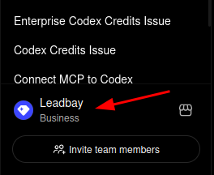<figcaption><p>Open the workspace menu</p></figcaption></figure>

**2. Click Settings.**

<figure>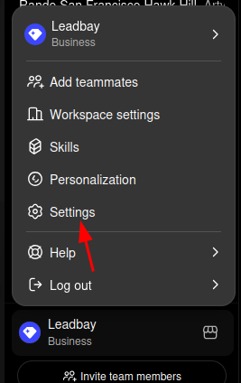<figcaption><p>Click Settings</p></figcaption></figure>

**3. Open the Apps tab** in the Settings sidebar.

<figure>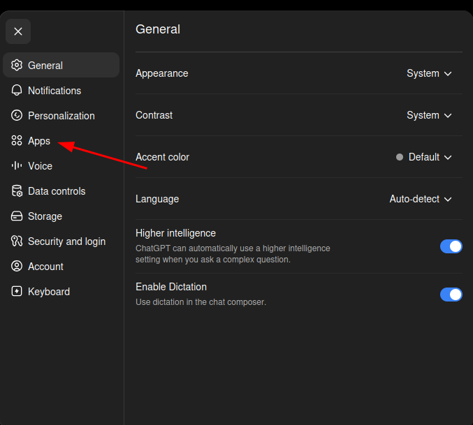<figcaption><p>Open the Apps tab</p></figcaption></figure>

**4. Click Advanced settings.**

<figure>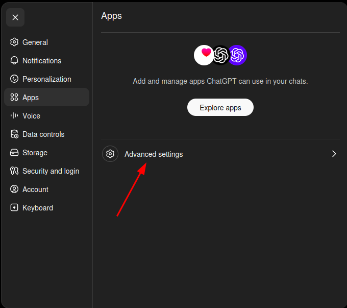<figcaption><p>Click Advanced settings</p></figcaption></figure>

**5. Turn on Developer mode.** This is required to add a custom MCP connector.

<figure>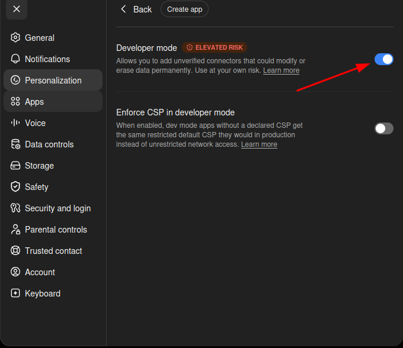<figcaption><p>Turn on Developer mode</p></figcaption></figure>

**6. Go back to Apps and click Create app.**

<figure>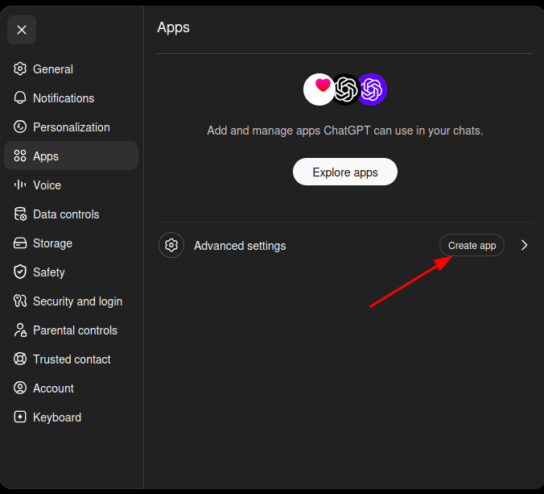<figcaption><p>Click Create app</p></figcaption></figure>

**7. Fill in the New App form:**

- **Name:** `Leadbay MCP`
- **Connection:** select **Server URL**, then enter `https://mcp.leadbay.app/mcp`
- **Authentication:** **OAuth**
- Check **I understand and want to continue**, then click **Create**.

<figure>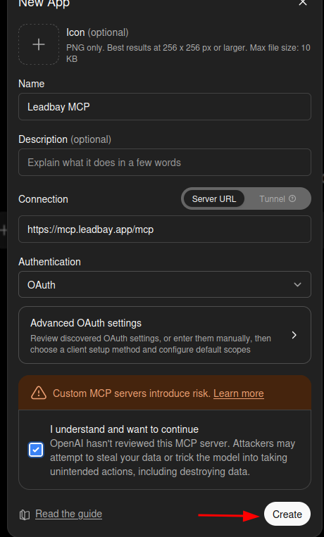<figcaption><p>Name it, set the Server URL and OAuth, then Create</p></figcaption></figure>

**8. Click Sign in with Leadbay MCP.** Log in and approve — ChatGPT is now connected.

<figure>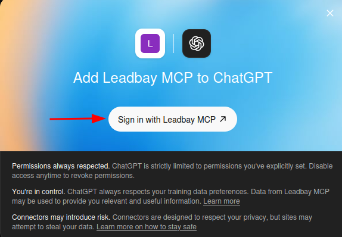<figcaption><p>Sign in with Leadbay MCP</p></figcaption></figure>

In a chat, enable the **Leadbay MCP** app from the composer **+** / tools menu so ChatGPT can call its tools.

### If the connection has a problem

If the app shows as disconnected or its tools stop responding, reconnect it:

**1. Open the Leadbay MCP app** (Settings → Apps → Leadbay MCP) and click the **⋯** menu (top-right).

<figure>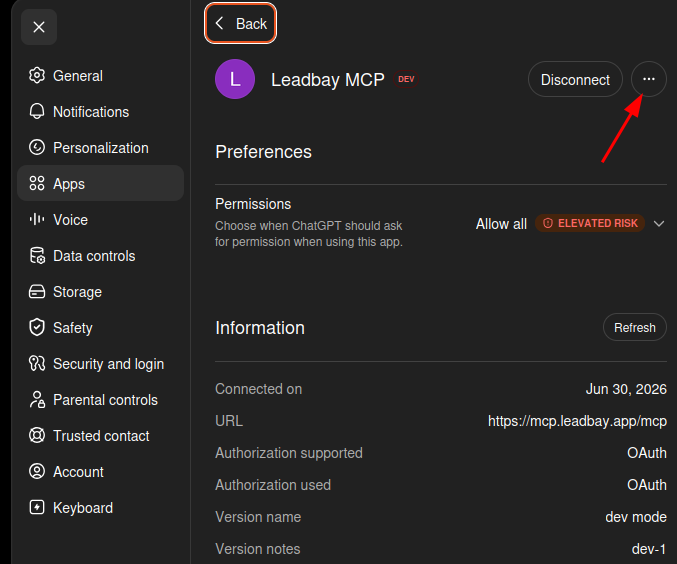<figcaption><p>Open the ⋯ menu on the Leadbay MCP app</p></figcaption></figure>

**2. Click Reconnect** and sign in again.

<figure>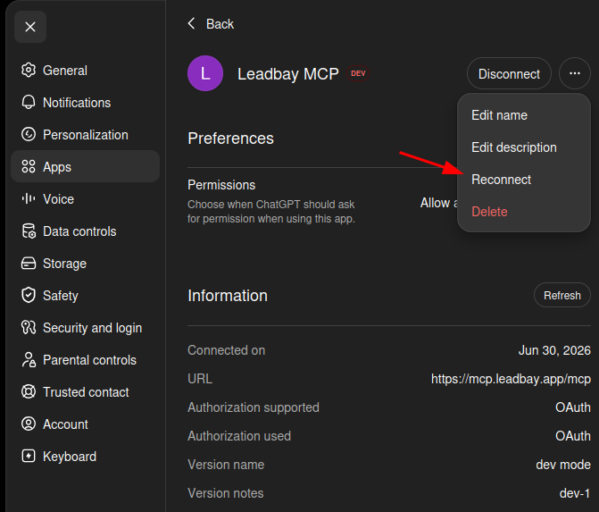<figcaption><p>Click Reconnect and sign in again</p></figcaption></figure>

---

## After you connect — your first leads

Whichever client you used, open a new conversation and try:

> _Show me today's leads and tell me which two are worth opening first._

A successful reply is a **ranked shortlist** — each lead with a fit score, a one-line "why it fits", and the best contact. If you see that, you're fully connected. 🎉


[Example prompts](example-prompts.md)


---

## Troubleshooting

| Symptom | Fix |
|---------|-----|
| "Not authenticated" / 401 errors | Your sign-in expired or was revoked. Trigger any Leadbay tool again and approve the **Sign in with Leadbay** prompt. |
| Connected, but "show me leads" returns an empty list | You're signed in fine — there's just nothing to show right now. Ask _"show me my lenses"_ to check which audience is active. |
| Tools don't appear after connecting | Open a new chat and wait a few seconds; send a second message and the tools finish loading. |
| Tools appear but the assistant won't call them | Open the connector settings and set the Leadbay tool groups to **Always allow** (Claude) or enable the connector in the composer (ChatGPT). |
| Custom connector option missing (Claude.ai / Claude Desktop / ChatGPT) | Custom connectors need a paid plan, and your workspace admin may need to enable them — see [Admin setup](admin-setup.md). On **Claude Desktop** you can skip the connector entirely with the [`.dxt` extension fallback](#claude-desktop). |
| Other issue | File a bug at [github.com/leadbay/mcp/issues](https://github.com/leadbay/mcp/issues). |

---

## Where to next


[What is Leadbay MCP?](what-is-leadbay-mcp.md)



[Tools reference](tools-reference.md)

