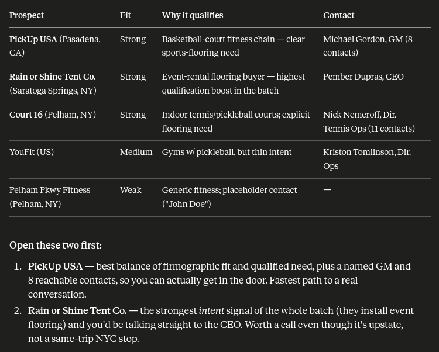

# Quickstart

Connect Leadbay to Claude and get your first qualified leads in about five minutes. This guide uses **Claude Desktop** — the simplest, one-click path. Using a different assistant? See [Installation](installation.md) for step-by-step setup of Claude.ai, Claude Code, ChatGPT, and Codex.


You'll need a [Leadbay account](https://leadbay.ai/) and Claude Desktop. That's it — no API tokens to copy or paste; you sign in with your browser.


---

## Step 1 — Install the extension

1. **[⬇ Download the Leadbay extension (.dxt)](https://github.com/leadbay/mcp/releases/latest)** — on the Releases page, click the file ending in **`.dxt`**.
2. **Double-click the downloaded `.dxt`.** Claude Desktop opens with the extension details — click **Install**, then toggle the extension to **Enabled**.


Doesn't open Claude? Install it from inside the app: **Settings → Extensions → Advanced → Install extension**, then pick the `.dxt` file.


---

## Step 2 — Relaunch and sign in

Claude Desktop takes a moment to load MCP tools, so:

1. **Fully quit and relaunch Claude Desktop** (Cmd-Q on Mac, then reopen — not just closing the window).
2. Open a new chat and wait about **30 seconds** before your first message.
3. The first time Claude uses a Leadbay tool, a **Sign in with Leadbay** page opens in your browser. Log in, click **Approve**, and the tab closes itself.

That's the whole connection — no tokens, no config files. Claude is now linked to **your** Leadbay account. You can revoke access anytime from **Settings → Connected apps**.


If your first message gets _"I don't see any Leadbay tools"_, the tools are still loading. Send any second message (even just _"try again"_) and Claude will pick them up. From there the session works normally.


---

## Step 3 — Ask for your first leads

Open a new conversation and type:

> _Show me today's leads and tell me which two are worth opening first._

Claude calls your Leadbay tools and replies with a short, ranked shortlist — company, why it fits, and the best contact to reach.

---

## Step 4 — What you should see

A successful first response looks like a **ranked table of leads**, not a wall of text. For each lead you'll get:

- a **score** (how well it matches your audience),
- a one-line **why it fits**,
- the **best contact** with a link where available.

If Claude replies with leads like that, you're fully connected. 🎉

<figure><figcaption>
A successful first reply: a ranked table of prospects, then the two worth opening first.</figcaption></figure>

---

## Step 5 — Keep going

Once you've seen your first leads, try these:

> _Research the top one for me — is it a fit?_

> _Draft me an outreach email to them._

> _I just emailed them. Log it as outreach._

Claude remembers the leads it surfaced, so you can keep referring to "the top one" without repeating yourself.

---

## Updating

When a new release ships, repeat **Step 1** (download the new `.dxt`, double-click, Install). Claude replaces the old version in place; your sign-in stays valid, so you don't need to re-authenticate.

---

## Using another assistant?


[Installation](installation.md)


Step-by-step setup for **Claude.ai**, **Claude Code**, **ChatGPT**, and **Codex** — plus the Claude Desktop steps above.

---

## Where to next


[Example prompts](example-prompts.md)



[Tools reference](tools-reference.md)

