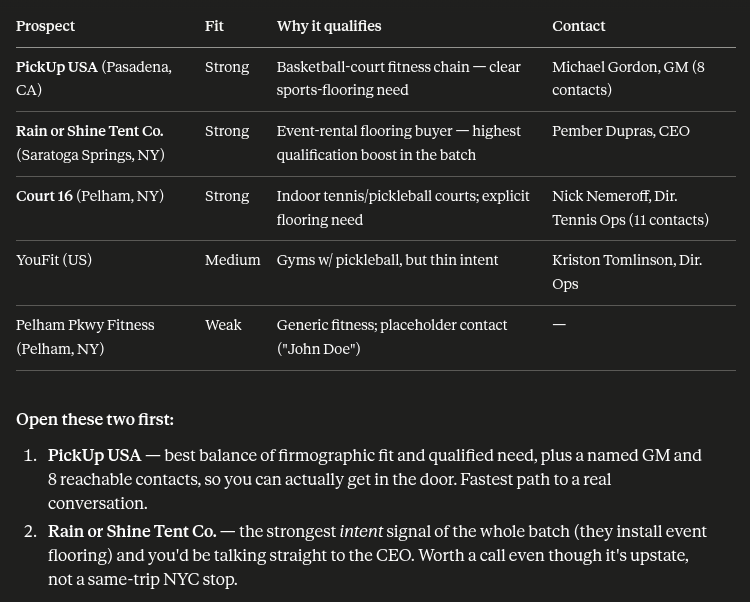

# Quickstart

Connect Leadbay to Claude and get your first qualified leads in about five minutes. This guide uses **Claude** (Claude.ai or Claude Desktop) — the simplest path. Using a different assistant? See [Installation](installation.md) for step-by-step setup of Claude Code, ChatGPT, and Codex.


You'll need a [Leadbay account](https://leadbay.ai/) and Claude (Pro, Max, Team, or Enterprise). That's it — no API tokens to copy or paste; you add one URL and sign in with your browser.


---

## First — which one are you?

Adding a custom connector needs a **paid Claude plan**, and in a **company workspace only an admin can add it**. Find your situation, then follow the steps below:

| Your situation | What to do |
|---|---|
| **Solo / personal paid plan** (not in a company workspace) | Add it yourself — follow Step 1 below. |
| **In a company workspace, and you're the admin** | Add it yourself (Step 1) — your teammates then just **Connect**. |
| **In a company workspace, not the admin** | You can't add it yourself. Send your admin the [Admin setup](admin-setup.md) guide; once they've added it, skip to **Step 2 — Sign in**. |
| **Can't add connectors / no admin to ask** | On **Claude Desktop**, install the [`.dxt` extension](installation.md#fallback-install-the-extension) instead — a per-user install with no admin gate. |

---

## Step 1 — Add the Leadbay connector

**[Add the Leadbay connector →](https://claude.ai/customize/connectors?modal=add-custom-connector&connectorName=Leadbay&connectorUrl=https%3A%2F%2Fmcp.leadbay.app%2Fmcp)**, then click **Add**. There are two server URLs — this link uses the US one, `https://mcp.leadbay.app/mcp`. If you're in France, use `https://mcp.leadbay.app/fr/mcp` instead.


Prefer step-by-step screenshots, or on a different assistant (Claude Desktop, Claude Code, ChatGPT, Codex)? See the full [Installation](installation.md) walkthrough.


---

## Step 2 — Sign in

1. Open the new **Leadbay** connector and click **Connect**.
2. A **Sign in with Leadbay** page opens in your browser — log in (or confirm your existing session) and click **Approve**.
3. The tab closes itself and Claude is connected.

That's the whole connection — no tokens, no config files. Claude is now linked to **your** Leadbay account, with all the leads you already have. You can revoke access anytime from **Settings → Connected apps**.

---

## New here? Take the guided tour

Not sure what to ask for first? Type:

> _Walk me through Leadbay._

Claude runs a short walkthrough on your own account — four steps, one button each, and you click to move forward:

| Step | What it does |
|---|---|
| **Check my account** | Which account you're on, and how much of your AI quota is left this week. |
| **Pull today's leads** | Today's batch from your lens — ranked, with a one-line reason each fits. |
| **Draft the first email** | Writes a first email to the top company. Nothing is sent. |
| **Find who to email** | Shows which roles exist there, then reveals the actual person — only if you confirm. |

Every step is a real action on your real account, not a demo. You can stop at any point with **I'm done for now**, or just type what you actually wanted — the walkthrough steps aside and Claude follows you there.


**Nothing is spent without your say-so.** The first three steps are free, and so is the preview of _which_ roles you could contact. Revealing a real email or phone number costs one credit per contact, and the walkthrough tells you the cost before you decide.


<!-- SCREENSHOT (optional) — the walkthrough's first step: the account card plus
     the two-option choice widget. Drop the image into
     .gitbook/assets/mcp-walkthrough-gate1.png and uncomment:
<figure><figcaption>
Step 1 of the guided tour: your account and quota, then one button to go on.
</figcaption></figure>
-->

Prefer to jump straight in? Skip the tour and go to Step 3.

---

## Step 3 — Ask for your first leads

Open a new conversation and type:

> _Show me today's leads and tell me which two are worth opening first._

Claude calls your Leadbay tools and replies with a short, ranked shortlist — company, why it fits, and the best contact to reach.


First message gets _"I don't see any Leadbay tools"_? The tools are still loading. Send any second message (even just _"try again"_) and Claude will pick them up.


---

## Step 4 — What you should see

A successful first response looks like a **ranked table of leads**, not a wall of text. For each lead you'll get:

- a **score** (how well it matches your audience),
- a one-line **why it fits**,
- the **best contact** with a link where available.

If Claude replies with leads like that, you're fully connected. 🎉

<figure><figcaption>
A successful first reply: a ranked table of prospects, then the two worth opening first.</figcaption></figure>

---

## Step 5 — Keep going

Once you've seen your first leads, try these:

> _Research the top one for me — is it a fit?_

> _Draft me an outreach email to them._

> _I just emailed them. Log it as outreach._

Claude remembers the leads it surfaced, so you can keep referring to "the top one" without repeating yourself.

---

## Using another assistant?


[Installation](installation.md)


Step-by-step setup for **Claude.ai**, **Claude Desktop**, **Claude Code**, **ChatGPT**, and **Codex**. US accounts use `https://mcp.leadbay.app/mcp`; France / EU use `https://mcp.leadbay.app/fr/mcp`.

---

## Where to next


[Example prompts](example-prompts.md)



[Tools reference](tools-reference.md)

