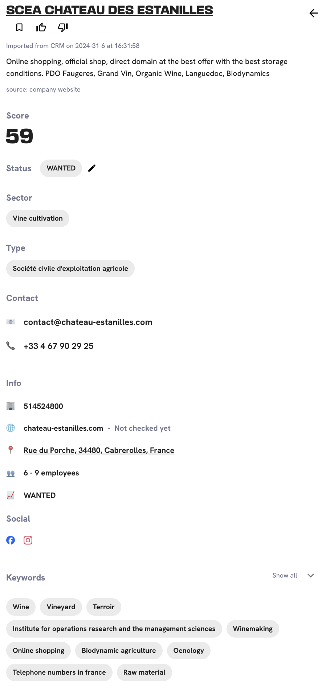

# 🎬 Changelog

## 2025-01-06

1. **Discover/Monitor - new leads loading**\
   → When users have new leads in Discover or Monitor, they can now see the previous leads while waiting for the new ones to load. They can also track the loading progress on the bottom of the page.

<figure><figcaption></figcaption></figure>

2. **Scoring**\
   → Both the algorithm and speed of Scoring have been improved.&#x20;

##

## 2024-12-10

1. **Lead profile**\
   -> Now, the user has access to the company's social media accounts.\
   -> They also have access to all available contact information (email, phone number, etc.).

<figure><figcaption></figcaption></figure>

2. **Filter**\
   -> The user can search for leads in a canton.\
   -> They can also distinguish between the canton and the city.

<figure><figcaption></figcaption></figure>

3. **Timeline** \
   → Leadbay congratulates the user on the most recently won leads.\
   → The Timeline now suggests new leads tailored to each user, adapting to their selected filters.

4. **SFTP connectors**\
   → Initially, we could connect the user's data with Leadbay only through a Zap file (Zapier). \
   -> Later, we managed to connect data from a Salesforce CRM.\
   -> Today, we offer an SFTP (Security File Transfer Protocol) connector that securely transfers data between Leadbay and sales reps' ERP systems, automating and streamlining the exchange of information. \

5. **Saved leads**\
   → The display of saved leads has been improved. \
   -> The user can now see the latest leads at the top of the list in each category of saved leads.

6. **Login/Create account journey**\
   -> The user journey for login/create account is now smoother and more intuitive. \
   -> This is also an opportunity to gradually introduce users to a new UI.

<figure><figcaption></figcaption></figure>

7. **List of leads**\
   → Previously, the user had to click on each lead to read a description of the company. \
   -> Now, the user can read a brief description of each lead directly in the leads list.

## 2024-10-17

1. The user can see if he has checked the website or not on the Lead Profile. It can be useful when he has too many saved leads but doesn't remember if he has checked the website.

<figure><figcaption></figcaption></figure>

2. In the filter, the names in Sector, Location and Keywords are placed in alphabetical order. It can be really useful when the user put dozens and dozens of cities and wants to delete one.

<figure><figcaption></figcaption></figure>

## 2024-10-14

<figure><figcaption></figcaption></figure>

1. The user needs to export leads from different tabs.\
   -> We created a new tab called **Saved Leads**. The tab works as a cart. The user can save leads from any pages in order to export them more easily, in CSV or on a Map. It can also allow the user to look at leads later. When a lead is unsaved it's not lost, the user can always find it in Monitor.

<figure><figcaption></figcaption></figure>

2. One of the most used feature is the like/dislike. So the user needs to be able to do it very quickly, without having to click on every lead. The buttons work as quick actions now.\
   -> We put like/dislike buttons on the line of the lead directly, along with the Save icon button.

<figure><figcaption></figcaption></figure>

3. The user doesn't need to keep his disliked leads on the Discover page. \
   -> The disliked leads directly go to Trash (there's a time period where the user can change his mind).\
   -> It allows the user to have a clear view of the new leads, or the leads that are likely to be prospected.

## 2024-09-15

<figure><figcaption></figcaption></figure>

* We noticed that many of our users are often on the go, visiting clients. They asked us to develop a map they can use to easily navigate to the leads they want to prospect. And here it is! Just select a number of leads, as if you were to export them, and hit "Map". You can also share a link to this map or open it on your phone for easiers navigation.&#x20;

<figure><figcaption></figcaption></figure>

## 2024-08-28

* Over the summer we've been making many improvements to our core data sources and models. And there are also few new end-user features (much more to come in the coming weeks).
* Leadbay sometimes suggests you the leads that you just coverted and did not yet report in your CRM. You can now signal them quickly so Leadbay can take them into account and find you some new leads to prospect.

<figure><figcaption></figcaption></figure>

* Easy to copy SIREN numbers (in case you want to know more about the company from the national register)

<figure><figcaption></figcaption></figure>

## 2024-07-29

<figure><figcaption></figcaption></figure>

A new major feature is out: the **Timeline**. Leadbay now learns from everything you do (clicks, likes, dislikes, exports) and generates smart recommendations for you to expend your quest for leads and look beyond the footworn path. The more you interact, the better it gets.

<figure><figcaption>
Timeline view
</figcaption></figure>

## 2024-06-03

* UX improvements to lenses: A simpler interface with lens-related controls more practically positioned around the same place.
* Improvements to refreshing discovery: More leads and improvement replacement mechanism for stale leads.
* Crawler improvements: doubled the number of new lead websites that gets discovered every week.

## 2024-05-21

<figure><figcaption></figcaption></figure>

A new major feature: **Refreshing Discovery**. Leadbay becomes a continuous flow of incoming relevant leads, that adaptes to tendencies, interactions with you as well as to your successes in particular parts of your market.&#x20;

New leads are marked with a green dot. Export the ones you want to prosepct, and they will be kept in your Monitor view. Leadbay will continuousely look for leads likely to be a good fit for you and bring new ones to your Discover view.

<figure><figcaption></figcaption></figure>

After repeatedly showing you a lead for some time, if you don't like or export it, Leadbay will consider it no longer interesting and will remove it from your Discover view (you can still find removed leads in the Trash for 30 days) and free up space for brining fresh new leads.

## 2024-04-22

<figure><figcaption></figcaption></figure>

* A major new feature: [Lenses](../product-guides/lenses.md). Lenses support multi-member teams or teams commercializing several products to several market segments. They allow you to keep your Leadbay experience separate in those different contexts. Use different parameters in each.

## 2024-04-07

* Leadbay experience is getting more and more personalized. You can now like and dislike leads and Leadbay will take them into account in finding new leads that it helps you discover.

## 2024-03-18

<figure><figcaption></figcaption></figure>

* Export leads through connectors. So far the export was only possible throught CSV files, and now you can directly export leads to your CRM through connectors (Zapier)
* You can now install Leadbay as a desktop app! Have it always handy to look up leads and insights.

<figure><figcaption></figcaption></figure>

* Better scoring experience. If you change scoring criteria in a radical way (such that not many of your wishlist leads fit the new criteria) Leadbay will now fetch fresh leads matching these criteria for a smoother experience.

## 2024-03-04

* Additional fields (website, location, etc.) in data import for an even better matching between your data and the Leadbay database. Better matching => more relevant results.
* 2 million additional leads were profiled with rich representations and can be discovered by our users.
* Simplified UI for defining wishlist and scoring criteria.

## 2024-02-12

<figure><figcaption></figcaption></figure>

* **A CRM connection with Zapier (beta):** You can now sync your CRM with Leadbay using Zapier. New leads that you add get scored automatically, and new wins immediately impact Leadbay's idea of who is likely to buy your products and services.
* **Smoother scoring**: We've changed the way scoring works, to make the score more easy to understand and relate to. Configure your scoring parameters, and the leads that best match them with get scores closer to 100.
* **Better keywords**: We've changed the way keywords work, by mooving away from classic keywords and using Knowledge Graph concepts instead. We are using DBPedia - a powerfull Knowledge Graph sourced from Wikipedia. In addition to being more relatable for the user, these concepts also give Leadbay agorithms ability to leverage more fine-grained concept-to-concept connections for even smarter results.

## 2024-01-29

<figure><figcaption></figcaption></figure>

<figure><figcaption></figcaption></figure>

* **Status Prediction in Lead Profile:** Leadbay now shows the predicted status for the leads that are not already won or lost.
* **Similar Past Leads in Lead Profile**: You can now see some of the most similar past leads for each new lead you are looking into. How these past leads performed may serve as usefull information to shape your expectations.
* **Discover and Monitor modes**: In addition to suggested leads (Discover mode) we now show status predictions and scores for leads already in your CRM (Monitor mode). Use the toggle button to switch between the two.

## 2024-01-15

* **AI Descriptions**: Leadbay now offers to-the-point short descriptions of every lead focusing on products and services the company offers and on the specificity of its market and customers - key factors for high-level understanding of a business.
* **Improved relevance**: Lead wishlists are no longer simple criteria selections. They now leverage Leadbay Compass - a language-based model that calculates lead-relevance and similarity. It's now easier to find the right lead among a large database of leads.

## 2023-12-18

* Further simplified onboarding (one step less)
* Leadbay now knows 8.736.710 leads
* Status prediction algorythm with 0.88-0.91 accuracy on latest tests
* Lead websites in lead profile

## 2023-12-04

* Added "I'm feeling lucky" option to make onboarding faster and let our AI choose wishlist criteria for you
* It's now possible to go back and forth throught onboarding steps
* Faster CSV file import and processing
* Improved quality of keywords, and translantions
* Billing is now possible using Stripe

