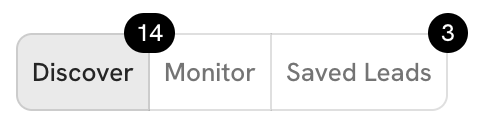

# 🎬 Changelog

## 2024-04-07

* Leadbay experience is getting more and more personalized. You can now like and dislike leads and Leadbay will take them into account in findhing new leads that it helps you discover.

## 2024-03-18

* Export leads throught connectors. So far the export was only possible throught CSV files, and now you can directly export leads to your CRM through connectors (Zapier)
* You can now install Leadbay as a desktop app! Have it always handy to look up leads and insights.

<figure><figcaption></figcaption></figure>

* Better scoring experience. If you change scoring criteira in a radical way (such that not many of your wishlist leads fit the new criteria) Leadbay will now fetch fresh leads matching these criteria for a smoother experience.

## 2024-03-04

* Additional fields (website, location, etc.) in data import for an even better matching between your data and the Leadbay database. Better matching => more relevant results.
* 2 million additional leads were profiled with rich representations and can be discovered by our users.
* Simplified UI for defining wishlist and scoring criteria.

## 2024-02-12

* **A CRM connection with Zapier (beta):** You can now sync your CRM with Leadbay using Zapier. New leads that you add get scored automatically, and new wins immediately impact Leadbay's idea of who is likely to buy your products and services.
* **Smoother scoring**: We've changed the way scoring works, to make the score more easy to understand and relate to. Configure your scoring parameters, and the leads that best match them with get scores closer to 100.
* **Better keywords**: We've changed the way keywords work, by mooving away from classic keywords and using Knowledge Graph concepts instead. We are using DBPedia - a powerfull Knowledge Graph sourced from Wikipedia. In addition to being more relatable for the user, these concepts also give Leadbay agorithms ability to leverage more fine-grained concept-to-concept connections for even smarter results.

## 2024-01-29

* **Status Prediction in Lead Profile:** Leadbay now shows the predicted status for the leads that are not already won or lost.
* **Similar Past Leads in Lead Profile**: You can now see some of the most similar past leads for each new lead you are looking into. How these past leads performed may serve as usefull information to shape your expectations.
* **Discover and Monitor modes**: In addition to suggested leads (Discover mode) we now show status predictions and scores for leads already in your CRM (Monitor mode). Use the toggle button to switch between the two.

## 2024-01-15

* **AI Descriptions**: Leadbay now offers to-the-point short descriptions of every lead focusing on products and services the company offers and on the specificity of its market and customers - key factors for high-level understanding of a business.
* **Improved relevance**: Lead wishlists are no longer simple criteria selections. They now leverage Leadbay Compass - a language-based model that calculates lead-relevance and similarity. It's now easier to find the right lead among a large database of leads.

## 2023-12-18

* Further simplified onboarding (one step less)
* Leadbay now knows 8.736.710 leads
* Status prediction algorythm with 0.88-0.91 accuracy on latest tests
* Lead websites in lead profile

## 2023-12-04

* Added "I'm feeling lucky" option to make onboarding faster and let our AI choose wishlist criteria for you
* It's now possible to go back and forth throught onboarding steps
* Faster CSV file import and processing
* Improved quality of keywords, and translantions
* Billing is now possible using Stripe

