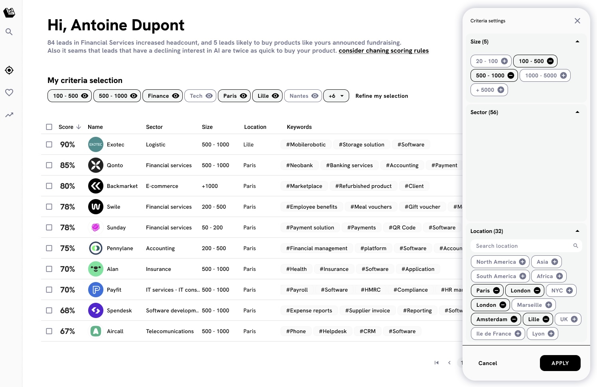
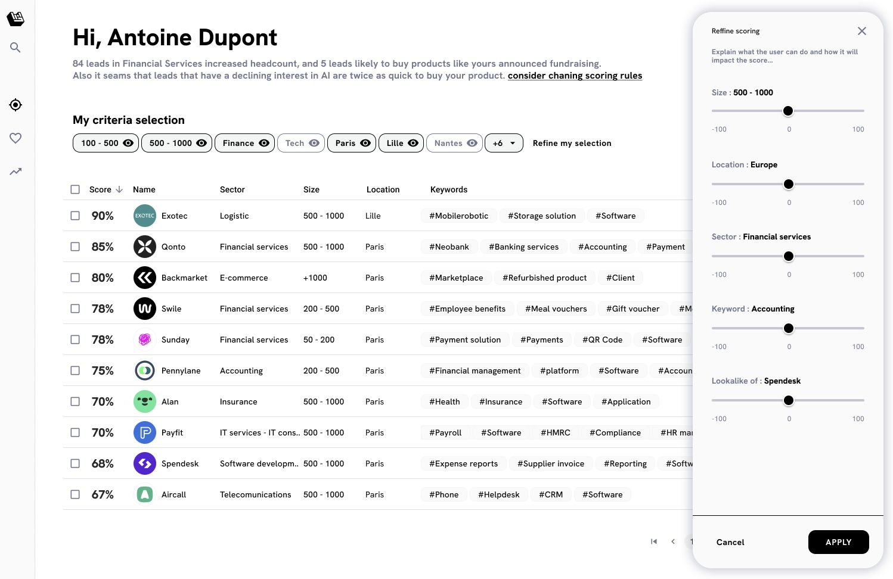

# 🧬 Features

## Configure a Wishlist

Our AI will look into your past wins and generate search criteria for you to find more [#user-content-lead](../fundamentals/definitions.md#user-content-lead "mention")s likely to buy your product or service. It’s a starting point that you can refine.

The [#user-content-lead](../fundamentals/definitions.md#user-content-lead "mention")s that match become your [#user-content-wishlist](../fundamentals/definitions.md#user-content-wishlist "mention"). Leadbay monitors them closely to generate insight and help you convert them.&#x20;


[understanding-wishlists.md](../product-guides/understanding-wishlists.md)


## Configure Scoring

Contrary to AI blackboxes, Leadbay lets you fully control the scoring. Boost the importance of certain criteria and immediately see how it affects the ranking of your leads.

Leadbay calculates lots of metrics in the background and will closely monitor how your scoring affects your performance. Together, the AI and you will quickly find the best way to proceed.


[understanding-scoring.md](../product-guides/understanding-scoring.md)

