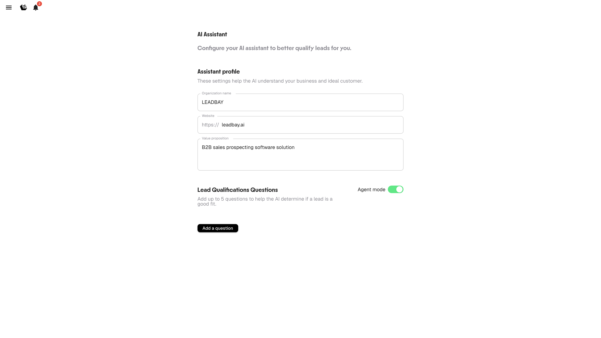

# AI Assistant

The AI Assistant automatically qualifies leads by answering custom questions about each company. It helps you focus on leads that truly match your ICP without manual research.

---

## How It Works

1. You define your organization profile and qualification questions
2. The AI analyzes each lead using public data, web insights, and your ICP description
3. Answers appear directly in lead profiles as color-coded indicators (🟢🔘🔴)
4. Answers factor into the lead score, pushing better-qualified leads higher

---

## Configuration

Open **AI Assistant** from the side menu (hamburger icon, top-right).

<figure><figcaption>
AI Assistant configuration
</figcaption></figure>

### Assistant Profile

Fill in these fields to calibrate the AI:

| Field | What to enter |
|-------|---------------|
| **Organization name** | Your company name |
| **Website** | Your company website URL |
| **Value proposition** | What you sell and to whom — be specific |

The clearer your value proposition, the better the AI understands what makes a lead relevant.

### Qualification Questions

Add up to **5 questions** that matter for your qualification process.

**Examples:**

- "Does this company use a CRM?"
- "Are they hiring salespeople?"
- "Do they operate in the construction sector?"
- "Is their revenue growing?"
- "Do they have an international presence?"

The AI will attempt to answer each question for every lead in your pipeline. Answers show as:

- 🟢 **Yes / Positive signal**
- 🔘 **Unknown / Unclear**
- 🔴 **No / Negative signal**

### Agent Mode

Toggle **Agent mode** on to have the AI proactively suggest next steps and approach angles for each lead. When enabled, lead profiles include AI-generated recommendations for how to engage.

---

## Impact on Scoring

Qualification answers influence the lead score. Leads that answer positively to more of your questions rank higher. Combined with like/dislike signals and won deal history, this creates a multi-layered scoring system.


Start with 2-3 questions and refine over time. Too many vague questions dilute the signal.

