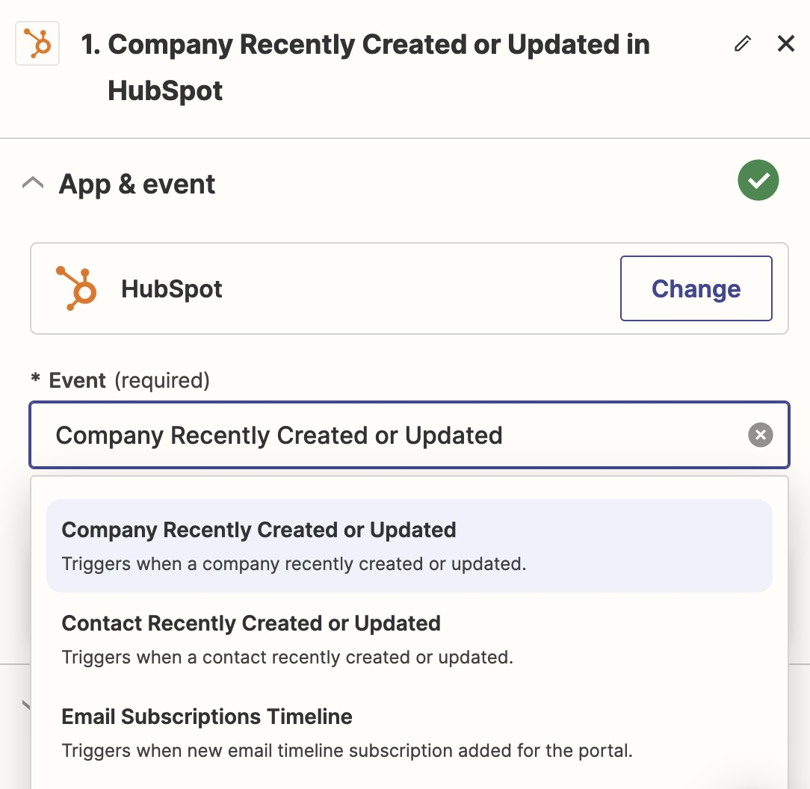

# 🔌 Connect your CRM with Zapier (beta)

#### What is Zapier?

Zapier acts as a bridge that connects thousands of apps and services, automating workflows without the need for coding. It enables the creation of automated actions, known as Zaps, which trigger when specific events occur in one app, leading to an action in another app, all without human intervention.

Leadbay relies on Zapier to connect to your CRM.

#### Leadbay Zapier Connection

To integrate Leadbay with Zapier, follow these steps:

1. **Access Invitation Link**: Leadbay's Zapier connection is currently invite-only. Access the integration using this link: [Leadbay Zapier Invitation](https://zapier.com/developer/public-invite/186700/14e581785fc33ed99c85faf9b70ec5d7/).
2. **Accept the Invite**: Click on the **Accept Invite and Build a Zap** button to proceed.
3. **Create Your Zap**:
   * Navigate to **+ Create** and select **New Zap**.
4.  **Set Up Your Trigger**:

    * Click on **Trigger** and search for your CRM tool (e.g., Hubspot, Salesforce) to set it as the data source. Ensure that the connection is properly configured.
    * Pick an event to trigger data export towards Leadbay. ideally make sure whenever there is a new company, or a change of status (e.g. `won`, `lost`) that your CRM lets Leadbay know.

    <figure><figcaption>
Pick a trigger
</figcaption></figure>
5.  **Configure Your Action**:

    * Click on **Action** to set up the Leadbay connection as the next step in your workflow.
    * To acctivate the connection, you must click on the `Sign in` button next to your Leadbay action and then. Zapier will prompt you to authorize it on Leadbay. Choose `Allow`.

    <figure><figcaption>
Allow Zapier on Leadbay
</figcaption></figure>

By following these steps, you can streamline your lead management process by connecting your CRM system with Leadbay through Zapier.
