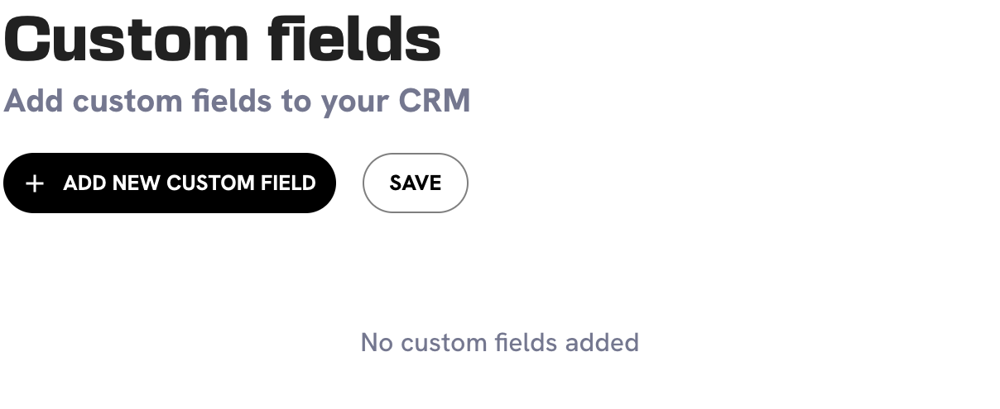
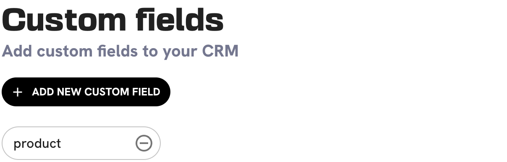
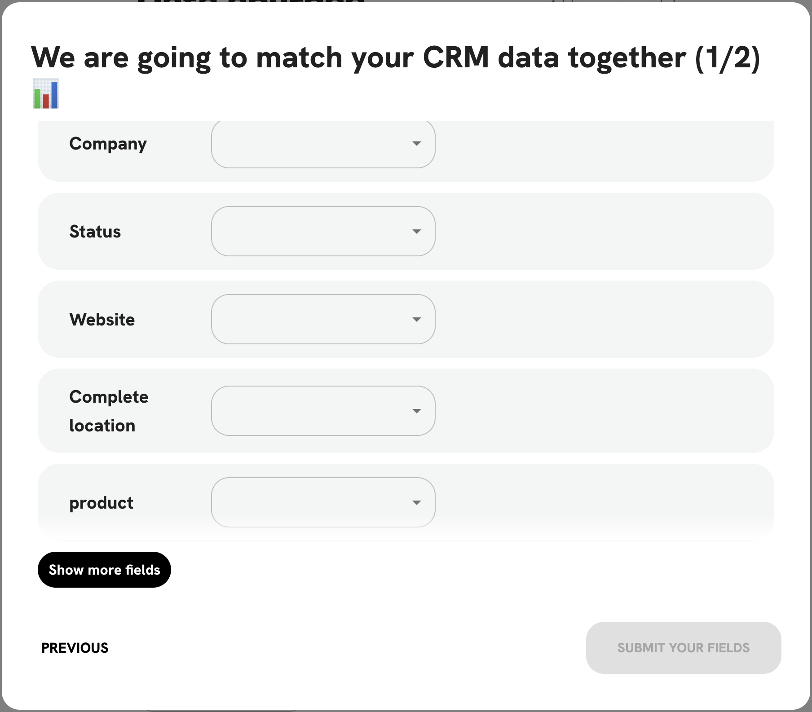

# 🎨 Product Lenses and Custom fields


This is currently a beta, work-in-progress feature. Contact support.


Organizations that sell different products may be in a situation where the same lead is good for one product but not good for the other. They should create Product Lenses, to indicate to the model that the notion of success of a lead is specific to a particular Product.

It works by defining a custom fild (a column in your CSV file, or a value in your CRM) and then configuring a lens that only matches a particular value of that custom field.

### Importing Custom Fields

Custom fields are a way to add additional information about your leads that is not present in the default fields. This can be useful for adding information that is specific to your business or industry.

To add a custom field:

1. Navigate to the [Data page](https://leadbay.app/integrations) and click on the "Add new custom field" button.

<figure><figcaption>
Add new custom field
</figcaption></figure>

2.  Fill in the name of the custom field.

    <figure><figcaption>
Custom field name
</figcaption></figure>
3.  Now you can import data. Follow the same steps as you would for importing a .csv file, but on the "Mapping fields" step, you will see your custom field listed.

    <figure><figcaption>
Custom field mapping
</figcaption></figure>

Note that you cannot yet edit the mapping of a data source that has already been imported.

### Configure a Product Lens

From the Lens Settings interface, edit a lens and toggle the `Product Specific Lens`option.

<figure><figcaption></figcaption></figure>
