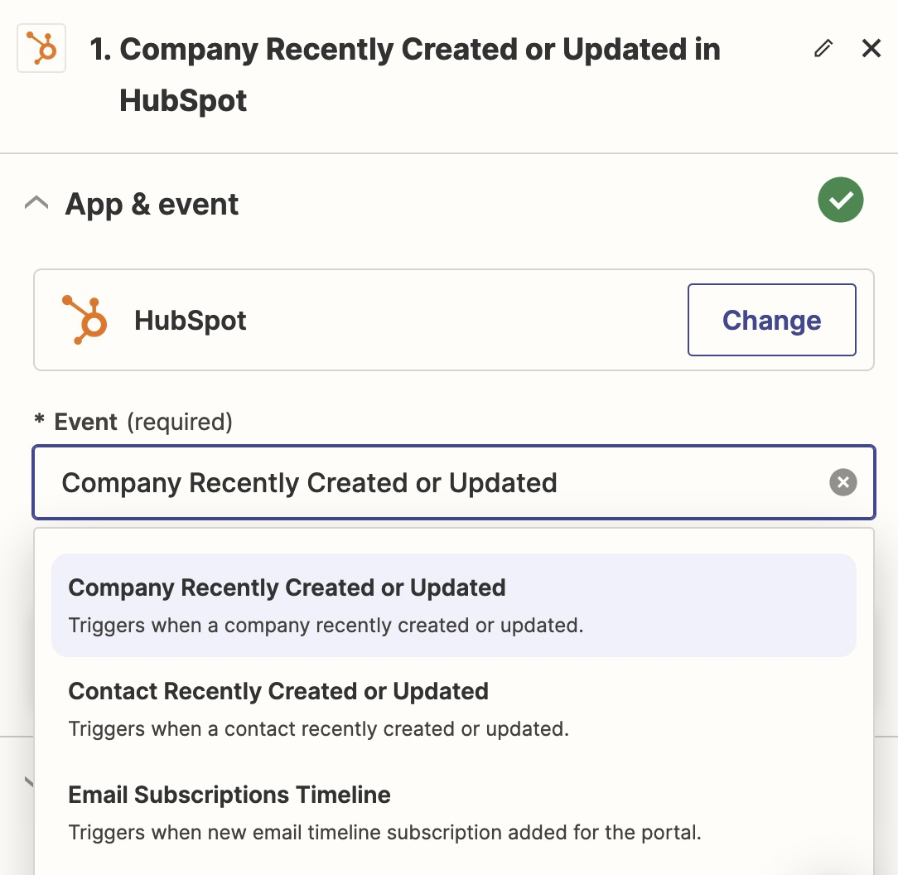

# 📥 Import CRM data with Zapier

To configure CRM data import using Zapier, if you have not already done so, you must first [enable Leadbay-Zapier connection](./#enabling-leadbay-zapier-connection).

* **Create Your Zap**:
  * From [Zapier homepage](https://zapier.com/app/zaps), navigate to **+ Create** and select **New Zap**.
* **Set Up Your Trigger**:
  * Click on **Trigger** and search for your CRM tool (e.g., Hubspot, Salesforce) to set it as the data source. Ensure that the connection is properly configured.
  * Pick an event to trigger data export towards Leadbay. ideally make sure whenever there is a new company, or a change of status (e.g. `won`, `lost`) that your CRM lets Leadbay know.

<figure><figcaption>
Pick a trigger
</figcaption></figure>

* **Configure Your Action**:
  * Click on **Action** to set up the Leadbay connection as the next step in your workflow.
  * To acctivate the connection, you must click on the `Sign in` button next to your Leadbay action and then. Zapier will prompt you to authorize it on Leadbay. Choose `Allow`. This is only necessary the first time you use Leadbay in your Zaps.

<figure><figcaption>
Allow Zapier on Leadbay
</figcaption></figure>

* Choose what to do in Leadbay

<figure><figcaption></figcaption></figure>

* Configure the mapping of fields between your CRM columns and variables Leadbay understands. The more fields you map the better Leadbay will be able to match your CRM data to companies that Leadbay's models know about. Click continue.

<figure><figcaption>
Mapping of fields
</figcaption></figure>

* In the end click on "Publish" to have your Zap up and running.
