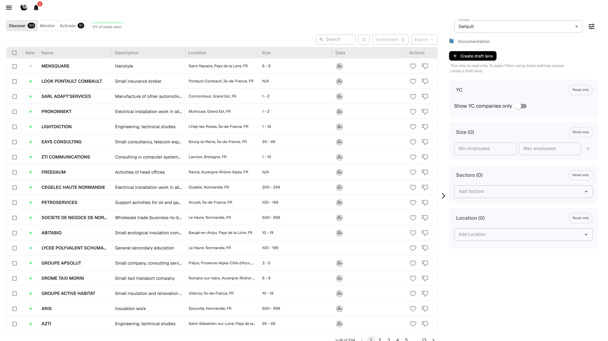
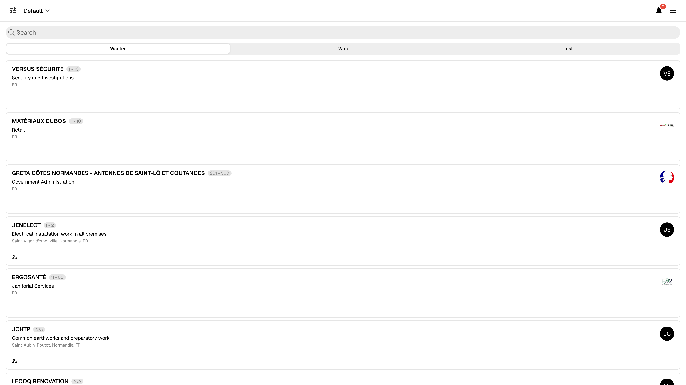

# Discover, Monitor & Activate

Leadbay organizes your prospecting workflow into three tabs. Each serves a distinct purpose in the lead lifecycle.

## The Lead Flow

```
Discover → Like → Activate → Prospect → Monitor
```

1. **Discover** surfaces new leads recommended by AI
2. You **like** the ones that match your target
3. Liked leads appear in **Activate** for daily prospecting
4. As you prospect (enrich contacts, send messages, plan meetings), leads move through statuses
5. Exported or status-assigned leads land in **Monitor** for long-term tracking

---

## Discover

AI-recommended leads based on your ICP (Ideal Customer Profile), past wins, and like/dislike history.

<figure><figcaption><p>Discover tab</p></figcaption></figure>

**What you see:**

| Column | Meaning |
|--------|---------|
| Green dot | New lead, not yet seen |
| Name | Company name |
| Description | Short AI-generated summary |
| Location | City / region |
| Size | Employee count range |
| Data | Data completeness indicator |

**Key actions:**

- **Like** (thumbs up): tells the model "show me more like this." The lead moves to Activate.
- **Dislike** (thumbs down): tells the model "not relevant." The lead is removed from Discover.
- **Click a lead** to open its profile for details before deciding.

**How it refreshes:** Leadbay continuously brings fresh leads into Discover. Leads you ignore for a while are automatically cycled out to make room for new ones. Exported leads move to Monitor.


Like 10-20 leads per session for best results. Mass-liking dilutes the signal to the AI.


---

## Monitor

Your pipeline: leads imported from a file, exported from Discover, or synced via Zapier. Use Monitor to score and track your existing accounts.

<figure><figcaption><p>Monitor tab</p></figcaption></figure>

**Columns:** Name, Description, Status, Location, Size, Data completeness.

**Lead statuses:**

| Status | Meaning |
|--------|---------|
| WANTED | You want to pursue this lead |
| NO STATUS | Not yet classified |
| WON | Deal closed successfully |
| LOST | Deal lost |

**Key actions:**

- Click a lead to open its profile and update its status
- Use filters (via Lenses) to focus on specific segments
- Export leads to CSV


Leads exported from Discover appear here automatically. That's why they "disappear" from Discover — they graduated to your pipeline.


---

## Activate

Your daily prospecting workspace. Shows liked leads ready for action, ranked by relevance.

<figure><figcaption><p>Activate tab</p></figcaption></figure>

**Columns:** Today's actions, Name, Description, Location, Source, Next step, Status, Last action.

**Lead classifications:**

- **Activatable**: leads ready for outreach
- **On hold**: paused leads
- **Completed**: leads with a final status

**Actions per lead** (via the Actions dropdown):

- **Still chasing**: you're actively pursuing
- **Meeting planned**: a meeting is scheduled
- **Could not reach**: no response yet
- **Not interested**: lead declined

**How to use Activate daily:**

1. Open Activate at the start of your prospecting session
2. Work through leads top to bottom
3. Open each profile, review AI summary and qualification answers
4. Enrich contacts, prepare your outreach
5. Log your prospecting action


Aim for a 1:1 ratio between liked leads and prospecting actions. Liking without acting is "squirrel mode" — it doesn't close deals.

