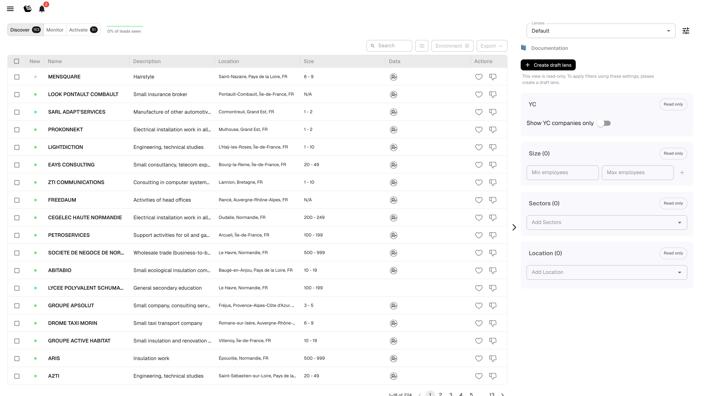
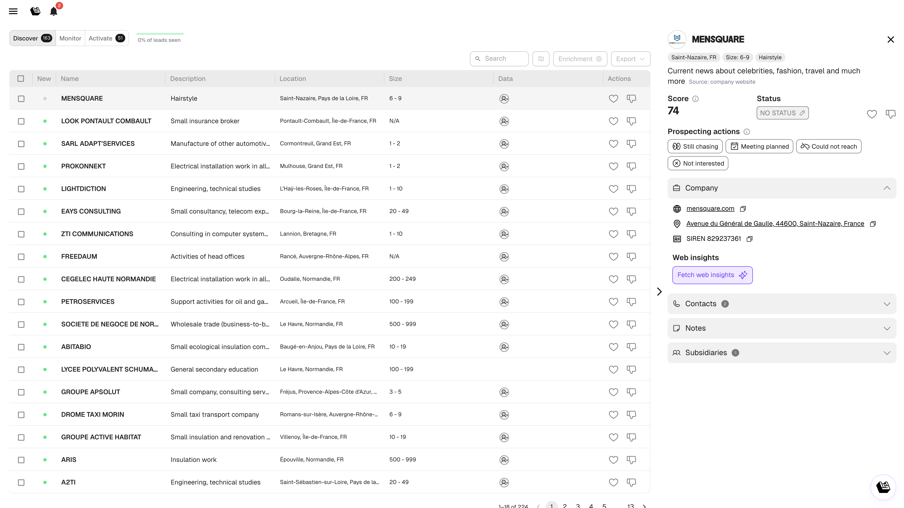
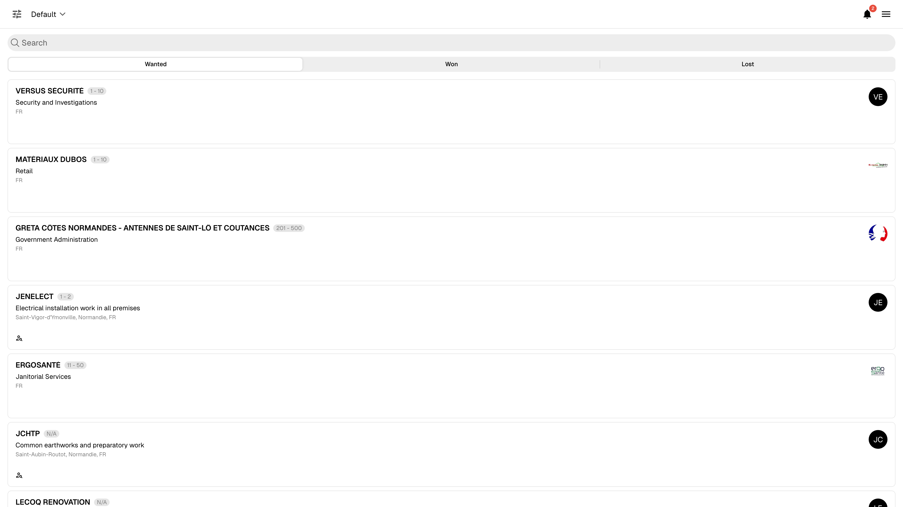
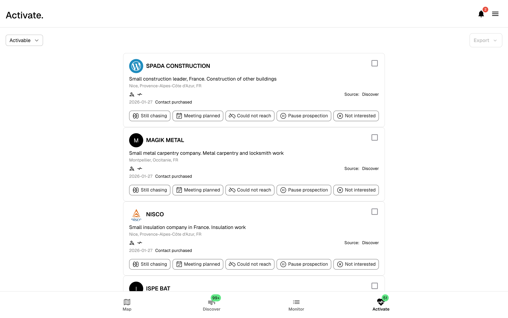

# Discover, Monitor & Activate

Leadbay organizes your prospecting workflow into three tabs. Each serves a distinct purpose in the lead lifecycle.

## The Lead Flow

```
Discover → Like → Activate → Prospect → Monitor
```

1. **Discover** surfaces new leads recommended by AI
2. You **like** the ones that match your target
3. Liked leads appear in **Activate** for daily prospecting
4. As you prospect (enrich contacts, send messages, plan meetings), leads move through statuses
5. Exported or status-assigned leads land in **Monitor** for long-term tracking

---

## Discover

AI-recommended leads based on your ICP (Ideal Customer Profile), past wins, and like/dislike history.

<figure><figcaption><p>Discover tab</p></figcaption></figure>

**What you see:**

| Column | Meaning |
|--------|---------|
| Green dot | New lead, not yet seen |
| Name | Company name |
| Description | Short AI-generated summary |
| Location | City / region |
| Size | Employee count range |
| Recommended contact | The best contact Leadbay knows about — click to enrich |
| Data | Data completeness indicator |

**Key actions:**

- **Like** (thumbs up): tells the model "show me more like this." The lead moves to Activate.
- **Dislike** (thumbs down): tells the model "not relevant." The lead is removed from Discover.
- **Click a lead** to open its profile for details before deciding.
- **Select leads** with the checkbox column, then use the floating action bar to **Qualify**, **Enrich**, or **Export**.

<figure><figcaption><p>Lead detail panel (split view)</p></figcaption></figure>

**How it refreshes:** Leadbay continuously brings fresh leads into Discover. Leads you ignore for a while are automatically cycled out to make room for new ones. Exported leads move to Monitor.


Like 10-20 leads per session for best results. Mass-liking dilutes the signal to the AI.


---

## Monitor

Your pipeline: leads imported from a file, exported from Discover, or synced via Zapier. Use Monitor to score and track your existing accounts.

<figure><figcaption><p>Monitor tab</p></figcaption></figure>

**Columns:** Name, Description, Status, Location, Size, Recommended contact, Last action, Data, Actions.

**Lead statuses:**

| Status | Meaning |
|--------|---------|
| WANTED | You want to pursue this lead |
| NO STATUS | Not yet classified |
| WON | Deal closed successfully |
| LOST | Deal lost |

### Filters

Click the filter icon in the top-right toolbar to open the filter popover. Filters are Notion-style: stacked rows of **[field] [operator] [value]** joined with AND, plus two top-of-popover toggles.

| Control | What it does |
|---------|--------------|
| **Only liked leads** | Restrict Monitor to leads you've liked |
| **Include leads from organization** | Show leads your teammates interacted with, alongside your own — for a complete org-wide pipeline view |
| **+ Add filter** | Add a [field] [operator] [value] row. Field picker is grouped into standard fields (Location, Sector, Size, Last action, Last action date) and CRM custom fields |
| **Reset all** | Clear every filter at once |

Custom-field text values auto-complete from your data as you type.

### Other actions

- Click a lead to open its profile and update its status
- Switch between **List**, **Split**, **Map**, and **Dashboard** views using the view-mode toggle
- Export leads to CSV


Leads exported from Discover appear here automatically. That's why they "disappear" from Discover — they graduated to your pipeline.


---

## Activate

Your daily prospecting workspace. Shows liked leads ready for action, ranked by relevance.

<figure><figcaption><p>Activate tab</p></figcaption></figure>

**Columns:** Today's actions, Name, Description, Location, Source, Next step, Recommended contact, Status, Last action.

**Lead classifications** (filter dropdown at the top-right):

- **Activatable**: leads ready for outreach
- **On hold**: paused leads
- **Completed**: leads with a final status

**Actions per lead** (via the Actions dropdown):

- **Still chasing**: you're actively pursuing
- **Meeting planned**: a meeting is scheduled
- **Could not reach**: no response yet
- **Not interested**: lead declined

**How to use Activate daily:**

1. Open Activate at the start of your prospecting session
2. Work through leads top to bottom
3. Open each profile, review AI summary and qualification answers
4. Enrich contacts, prepare your outreach
5. Log your prospecting action


Aim for a 1:1 ratio between liked leads and prospecting actions. Liking without acting is "squirrel mode" — it doesn't close deals.


---

## Search

Find any lead instantly across all tabs — Discover, Monitor, and Activate.

<figure><figcaption><p>Search for leads by name across all tabs</p></figcaption></figure>

**How to search:**

- Press **⌘K** (Mac) or **Ctrl+K** (Windows/Linux) to open the search dialog
- Type a company name — suggestions appear as you type
- Click a result to jump directly to the lead profile

Search results indicate which tab each lead belongs to, so you always know where you are in the pipeline.
