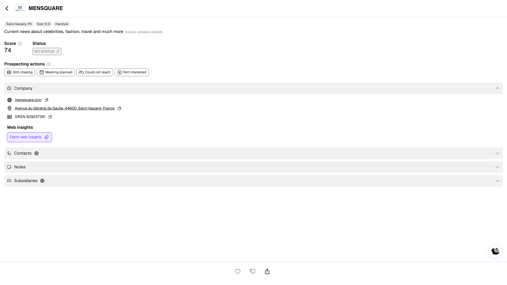

# Lead Profile

Click any lead name to open its profile. The profile is your central view for understanding a company and deciding how to engage.

<figure><figcaption>
Lead profile
</figcaption></figure>

---

## Header

At the top of every profile you'll find:

- **Company name** and logo
- **Tags**: location, employee size, sector
- **Short description** (AI-generated from public data)
- **Score** (0–99): how closely this lead matches your liked leads and won deals. Higher is better.
- **Status**: click to change (NO STATUS, WANTED, WON, LOST)
- **Like / Dislike** buttons

---

## Prospecting Actions

Quick buttons to log your outreach activity:

| Action | When to use |
|--------|-------------|
| **Still chasing** | You've reached out, waiting for a reply |
| **Meeting planned** | A meeting is confirmed |
| **Could not reach** | No response after attempts |
| **Not interested** | The lead explicitly declined |

These actions appear in the Activate tab and are tracked in the Manager Dashboard.

---

## Tabs

### Company

Firmographic data:

- **Website** (clickable link)
- **Address** (with map link)
- **SIREN** number (for French companies, clickable to copy)
- **Social media** links

### Contacts

- **Enriched/added contacts**: contacts with email, phone, LinkedIn already available
- **To be enriched contacts**: suggested contacts based on your target persona — click **Enrich** to get their details

See [Contact Enrichment](contact-enrichment.md) for details.

### Notes

A space to capture notes about the lead. You can:

- Type notes directly
- Upload a file or photo (e.g., business card)
- Notes are visible to your team and saved chronologically

### History

Timeline of all interactions: status changes, likes, enrichments, exports. Helps you see the full engagement story at a glance.

### Subsidiaries

Shows related entities and child companies within the same corporate group. Useful for expanding prospecting within a group structure.

---

## Web Insights

Click **Fetch web insights** to pull fresh data from the company's website:

- **Company profile**: activities, products, services, employee count, target market
- **Key people & organization**: decision-makers and org structure
- **Technologies & Innovation**: tools and software the company uses

Results are cached — you can re-fetch anytime for updated data.

---

## AI Summary & Qualification

If the [AI Assistant](ai-assistant.md) is configured:

- An **AI summary** appears with context and predictions
- **Qualification answers** show as indicators: 🟢 positive, 🔘 neutral, 🔴 negative
- **Predicted next steps** and recommended approach angles

These help you prepare before reaching out, without manual research.
