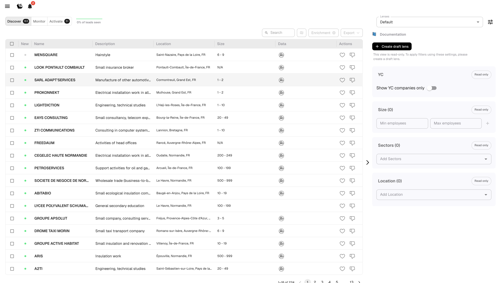

# Lenses

Lenses are saved filter configurations that define which leads you see. Each lens targets a specific market segment — by sector, location, company size, or keywords.

Lenses also power AI recommendations: the system learns from your likes and wins within each lens to suggest increasingly relevant leads.

---

## Choosing a Lens

The lens selector appears at the top of the page. Pick a lens from the dropdown to instantly load its filters and recommendations.

<figure><figcaption>
Lens selector
</figcaption></figure>

Whatever filters you change remain attached to the currently selected lens. Switch lenses and the parameters change with it.

---

## Organization Lenses vs Private Lenses

There are two types of lenses:

| Type | Visibility | Who can edit |
|------|-----------|--------------|
| **Organization lenses** | Shared with all team members | Admins |
| **Private lenses** | Only visible to you | You |

One organization lens is marked as **Current** (the default lens for the team). You can promote a private lens to an organization lens if you want your team to share it.

---

## Creating and Managing Lenses

Click the lens settings icon (gear) to open the lens management panel.

From here you can:

- **Create a new lens**: type a name and click +
- **Edit** a lens (pencil icon): rename it
- **Delete** a lens (trash icon)
- **Promote** a private lens to organization (arrow up icon)
- **Set as current** organization lens (arrow down icon)

### Draft Lenses

If the current lens is **read-only** (e.g., the default organization lens when you're not an admin), you can click **Create draft lens** to make an editable copy. Adjust filters in your draft, then optionally promote it.

---

## Lens Filters

Filters define which leads match a lens. Anything Leadbay knows about a company can be a filter criteria.

### Available Filter Types

| Filter | Example |
|--------|---------|
| **Location** | Paris, Lyon, Occitanie |
| **Sector** | Financial Services, Agriculture |
| **Size** | 10–200 employees |
| **Keywords** | SaaS, B2B, renewable energy |

### How Filters Combine

**Within the same filter type** (e.g., multiple sectors): Leadbay uses **OR** logic. A lead matching *any* of the selected sectors qualifies.

**Across different filter types** (e.g., sector + size): Leadbay uses **AND** logic. A lead must match *all* filter types.

**Example:** Sectors = `Financial Services, Agriculture` + Size = `50-100`
- A bank with 75 employees: **matches** (Financial Services AND 50-100)
- A farm with 200 employees: **does not match** (Agriculture but NOT 50-100)
- A tech company with 80 employees: **does not match** (NOT Financial Services or Agriculture)

---

## How Lenses Affect AI Recommendations

Each lens builds its own AI model. The system learns from:

- Leads you **liked** within this lens
- Leads marked as **won** within this lens
- Your **qualification question** answers

The result is a relevance **score (0–99)** for each lead, specific to the active lens. Switch lenses and scores change because the AI model is different.


If you sell multiple products to different markets, create one lens per product/segment. This gives each segment its own AI model and recommendations.

