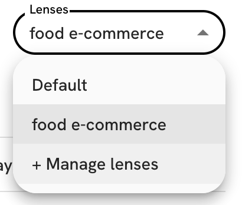

# 🔭 Lenses

Lenses allow you to save your [Wishlist](understanding-wishlists.md) and [Scoring](understanding-scoring.md) parameters and reuse them later. Super handy when you prospect several disctinct segments at the same time, or when you are selling more than one product.

<figure><figcaption>
Lenses
</figcaption></figure>

Pick a lens from the dropdown menu. Whatever changes you make to your Wishlist and Scoring parameters will remain attached to that lens. Pick another lens and everything changes - the parameters of that new lens get loaded instantly.&#x20;

Go to "Manage lenses" to create new lenses, rename or delete existing ones.
