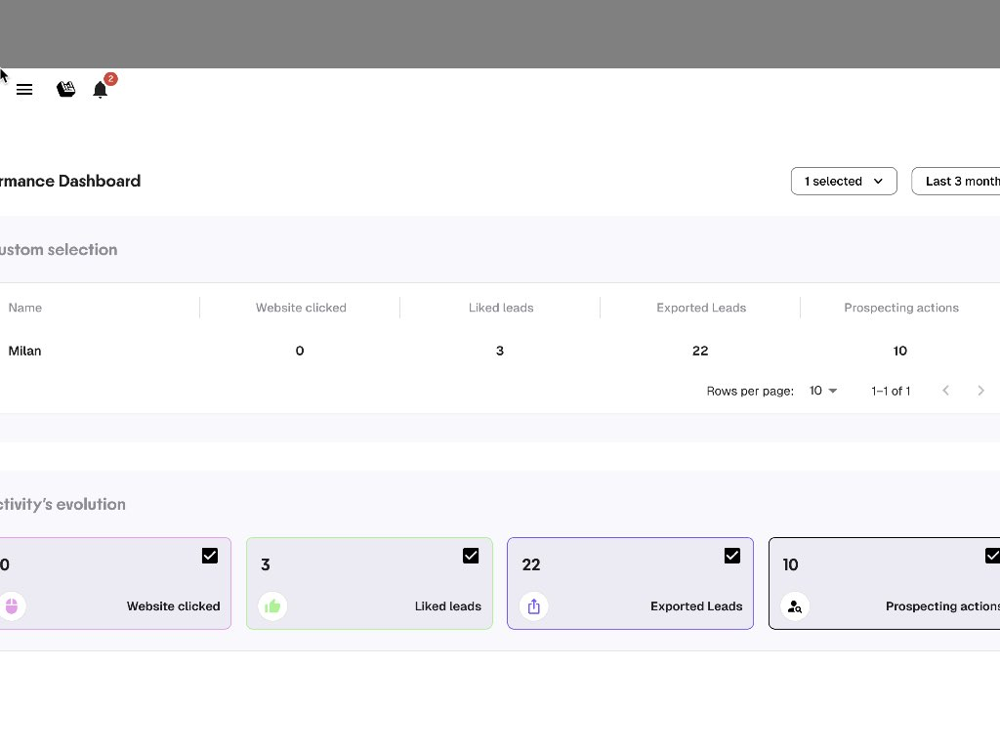

# Manager Dashboard

The Dashboard gives managers visibility into their team's prospecting activity, and lets individual reps track their own performance.

<figure><figcaption>
Manager Dashboard
</figcaption></figure>

---

## Accessing the Dashboard

Open the side menu (hamburger icon, top-left) and click **Dashboard**.

---

## Filters

At the top of the dashboard, two controls:

- **Team member selector**: pick one, several, or all team members
- **Time range**: Last 3 months, Last month, Last week, or custom range

---

## Metrics Table

A table comparing team members across four key indicators:

| Metric | What it counts |
|--------|---------------|
| **Website clicked** | Number of lead websites visited |
| **Liked leads** | Leads liked (thumbs up) |
| **Exported leads** | Leads exported to CSV or CRM |
| **Prospecting actions** | Actions logged (still chasing, meeting planned, etc.) |

Each row is one team member. Use this to spot who's active and who might need support.

---

## Activity Evolution Chart

Below the table, a chart shows the trend over time for each metric. Toggle metrics on/off using the checkboxes to focus on what matters.

This chart captures **every interaction**, so numbers may be higher than the lead list (a user can interact with the same lead multiple times).


Open the Dashboard at every weekly team meeting. It takes 10 seconds to spot who's building momentum and who's falling behind.

