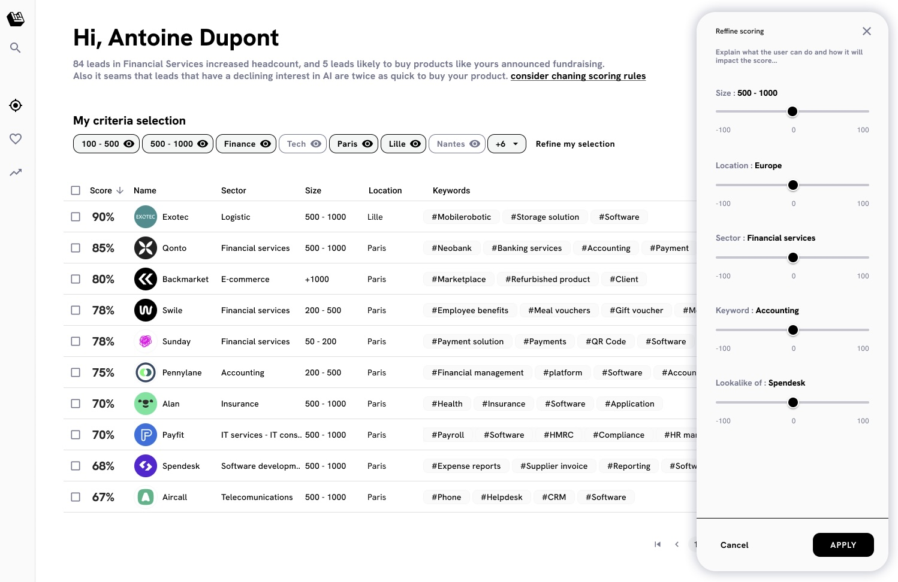

# 🏅 Understanding Scoring

Our AI selects the key [#user-content-attribute](../fundamentals/definitions.md#user-content-attribute "mention")s and their values that play a role in raking your leads.

<figure><figcaption>
Scoring configuration
</figcaption></figure>

You can ajdust the importance they have manually and directly see how it impacts the ranking of the list.

Moving the slider to the left will add negative points to the the attribute value, and moving the slider to the right will add positive points.&#x20;

In the end, whatever the number of attributes the final score is projected to the 0-100 scale for convenience.
